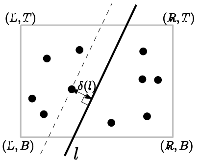
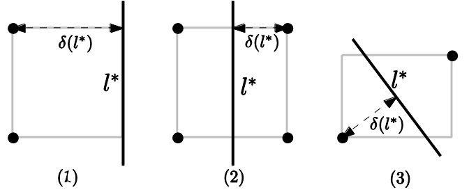

## 문제

ICPC City is a newly emerging and developing city. Recently, its population has been unexpectedly increased so that it’s now on the situation that several city-managed facilities should be improved, extended, or renovated. Among such facilities must be the sewerage system; a recent report on the sewerage system in ICPC City says that a new sewerage backbone pipeline needs to be constructed through the city. Although the recent sewerage systems are proven to be clean and well-managed by automated control system, people living in ICPC City still want to keep as far as possible from the sewerage backbone pipeline to be placed through the city.

ICPC City is a modern and well-planned city, so is of a perfectly rectangular shape with four vertices (L, B), (L, T), (R, T), and (R, B) for some L < R and B < T. The sewerage backbone pipeline should be a straight line crossing ICPC City since it should connect neighboring regions of ICPC City. Further, we want to place the sewerage pipeline as far as possible from ‘everyone’ in the city because nobody likes to keep it close. The population in the city is given as a set of N points Pi = (Xi , Yi) with L ≤ Xi ≤ R and B ≤ Yi ≤ T.

In order to precisely determine the optimal planning of the sewerage backbone, we define the following objective function: for any line l through the city area,

δ(l) := mini=1,...,N d(Pi , l),

where d(Pi , l) denotes the Euclidean (perpendicular) distance from point Pi to line l. In other words, δ(l) takes the minimum over distances from all Pi to line l for i =1,...,N.

  
Figure 1. How to find δ(l) for a given line l through the city area

Figure 1 shows an example of the city area bounded by the rectangle and how to calculate the value of δ(l) for a given line l. An optimal planning of the sewerage backbone is defined to be a line l\* that maximizes δ(l) over all lines l intersecting the city area, represented by the rectangle with vertices (L, B), (L, T), (R, T), and (R, B). See Figure 2 below, illustrating three basic cases of an optimal planning of the sewerage backbone l\*.

  
Figure 2. Three basic examples

Your task is to write a program that finds an optimal planning l\* of the sewerage pipeline and the value δ(l\*), for given as input: L, R, B, T, and N points Pi representing the population in ICPC City.

## 입력

Your program is to read the input from standard input. The input consists of K (1 ≤ K ≤ 20) test cases. The number of test cases K is given in the first line of the input. Each test case is given as four numbers L, R, B, T (-1,000 ≤ L < R ≤ 1,000; -1,000 ≤ B < T ≤ 1,000) defining ICPC City area, the number N (1 ≤ N ≤ 500) of points and the N points themselves; L, R, B, and T are given in one line as real numbers with precision of exactly 3 digits below after decimal point. In the succeeding line, N is given as an integer, and then N points Pi representing the population are given by two real numbers Xi , Yi with precision of exactly 3 digits below after decimal point, representing X- and Y-coordinates of Pi , respectively, line by line.

Note that two neighboring numbers in a line is separated by a single space.  
(See the sample input below. Each test case corresponds to that illustrated in Figure 2(1)~(3).)

## 출력

Your program is to write to standard output. Print exactly one line for each test case. The line should contain the value of δ(l\*) for an optimal planning l\* of the sewerage pipeline. The output must have a precision of exactly 3 digits after decimal point. You may round to the 3 digits after decimal point or round off at the 3rd digit after decimal point.
