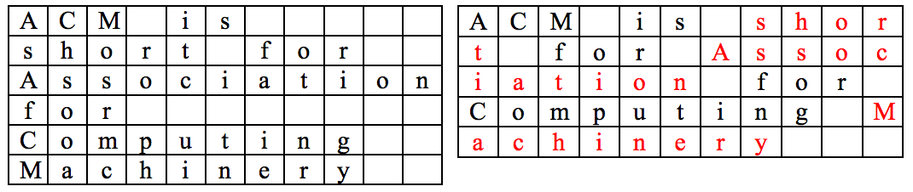

## 문제

ACM (Advanced Communication Machinery) is a famous mobile-phone manufacturing company. Nowadays, programmers of ACM are making a GUI for their brand-new mobile phone, ACM Touch. Designers want a scrollbar interface on it. A scrollbar is a graphical object in a GUI with which continuous text, pictures or anything else can be scrolled including time in video applications, i.e., viewed even if it does not fit into the space in a computer display, window, or viewport. A scroll bar is usually designed as a long rectangular area on one or two sides of the viewing area, containing a bar that can be dragged along a track to move the body of the document. To compute the size of the thumb, we need to know the length on which the whole document is displayed.

In ACM Touch, a text is displayed by following manner:

1. Direction of displaying is from left to right, and from the top of the display downward.
2. Words should be separated by either a blank space or a new line.
3. Do not place one or more blank spaces inside a word.
4. A new line is allowed if and only if a current word does not fit in the remaining space of the current row.
5. If a blank space is to be placed at the beginning of the new line, it should not be displayed.

You are to program that calculates the minimum number of rows to display a given text. Assume that every word’s length is less than or equal to the width of columns.

Example: “ACM is short for Association for Computing Machinery” can be displayed as follows. The former is suitable for ACM Touch, but the latter is not.

## 입력

The input contains several test cases. The first line of the input contains an integer number 1 ≤ T ≤ 20 that indicates the number of test cases. In each test case, the first line is an integer 1 ≤ w ≤ 100 indicating the width of the mobile phone screen. The second line is the text to display. The length of text is not larger than 2000 characters. You can assume that there is no word whose length is longer than w. Texts are composed by the Roman alphabets.

## 출력

Your program is to write to standard output. For each test case, print an integer indicating the minimum number of lines needed to display the text according to the manner described above.
