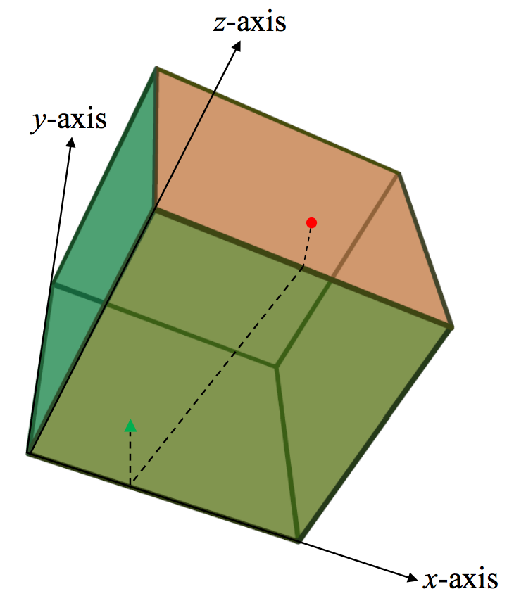

## 문제

The robot Romy lives in a cube planet. This robot is male type. Romy is managing the planet according to the instructions encoded into himself. The robot has been living alone on the surface of the cube planet for 30 years. One day, Romy got a message from a robot called Nancy that she made crash-landing on the planet by using robot telecommunication protocol. She said that she cannot move because her motion control system is broken after the crash-landing. After hearing the voice of Nancy, Romy was happy. He thought that he is not alone anymore. But he was worried because she cannot move. He gathered all fixing tools to repair her motion control system. Then he asked her GPS position. She told her GPS coordinates. After getting the coordinates of her current position, Romy want to get her by using the shortest path. The figure shows the current status. The red circle is Romy. And the green triangle is Nancy. The dotted line is the shortest path between the two on the surface of the cube planet.

## 입력

Your program is to read from standard input. The input consists of T test cases. We assume that Romy and Nancy is on the surface of a cube represented by [0,8] × [0,8] × [0,8] . The orientation of each axis is given like the above figure. The number of test cases, T (1 ≤ T ≤ 20) is given in the first line of the input. At the first line of each test case, three integers x1, y1, and z1 which indicate the x,y,z-coordinates of intial position of Romy, are given. At the second line of the each test case, three integers x2, y2, and z2 which indicate the x,y,zcoordinates of initial position of Nancy, are given. There is a single space between the integers. Romy’s zcoordinate is always 8 which mean that Romy’s initial position is on the top surface of the cube. Each initial position is given as a point on the surface of the cube.

## 출력

Your program is to write to standard output. For each test case, print the square of the distance of the shortest path on the surface of the cube between Romy and Nancy.
