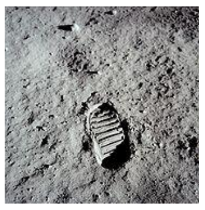

## 문제

Now this time, when Cinder Maid came to the hall, she was a desirous to dance only with the prince as he with her, and so, when midnight came round, she had forgotten to leave till the clock began to strike, one -- two -- three -- four -- five -- six, -- and then she began to run away down the stairs as the clock struck eight -- nine -- ten. But the prince had told his soldier to put tar upon the lower steps of the stairs; and as the clock struck eleven her shoes stuck in the tar, and when she jumped to the foot of the stairs a shoe print of her was left behind, and just then the clock struck TWELVE, and the golden coach with its horses and footmen, disappeared, and the beautiful dress of Cinder Maid changed again into her ragged clothes and she had to run home.

  
A famous Shoe-print

Now when the prince found out that he could not keep his lady-love nor trace where she had gone he spoke to his father and showed him the shoe print, and told him that he would never marry anyone but the maiden. So the king, his father, ordered his algorist to gather all kinds of shoes in his kingdom and find out which shoe fits the shoe-print.

The algorist observed that the maiden’s shoe-print is from her right shoe. So the algorist gathered sample of all right shoes in the kingdom and got their shoe-prints. Finding out the model the maiden were wearing was a difficult job because there are many shoe-prints look similar to the maiden’s shoe-print. So the algorist decided to use computer program to find out which model is the maiden’s shoe. He let one of his apprentices to scan the shoe-print and solve a shoe-print matching problem. You, as an apprentice of the algorist, need to make a program whether decides given two shoe-prints are identical. Two shoe-prints are considerd to be identical if the one shoe-print can be fitted exactly over the other by rotation and translation.

## 입력

Your program is to read from standard input. The input consists of T test cases. The number of test cases T (1 ≤ T ≤ 20) is given in the first line of the input. The first line of each test case contains an integer N (1 ≤ N ≤ 3000) which is the number of point in the boundary of each shoe-print. Each of next 2 × N lines contains two floating point numbers x and, y (-100 ≤ x, y ≤ 100), which is the Cartesian coordinate of a point. First N lines describe the first shoe-print and following N lines describe the second shoe-print, respectively. The points are ordered by clockwise order. And all numbers are separated by white spaces. You can assume that continuous three points do not lie in a single line.

## 출력

Your program is to write to standard output. Print exactly one line for each test case. The line should contain a character indicating the result. If two shoe-prints are identical print ‘y’, otherwise, print ‘n’.

PRECISION: for deciding equality of two real numbers, you can consider two real numbers are equal if their difference is less than 0.01
