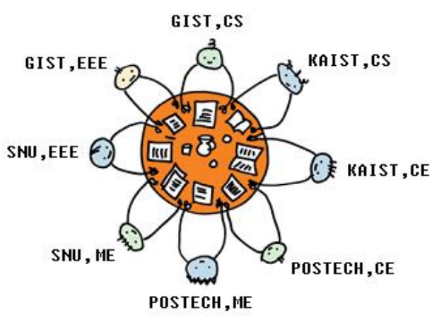

## 문제

A conference has been arranged in KAIST where top two researchers from each university of Korea have been invited. Two researchers of each university are from the same or different majors. The organizing committee has to make a sitting arrangement for all the researchers around one big round table. At the beginning of the conference both the researchers of each university will introduce themselves to other researchers around them. So, it is important that both the researchers of each university sit side by side. Also during the conference the researchers may become interested to discuss their research works with other researchers of the same major. So, it is also desirable that two researchers of two different universities sitting side by side share the same major. You have to find if there is any sitting arrangement which satisfies the following two conditions:

1. Two researchers of each university sit side by side
2. Each pair of researchers sitting side by side either belong to the same university or share the same major

The following figure shows a sitting arrangement satisfying these two conditions.

## 입력

The input contains T test cases. The number of test cases T (1 ≤ T ≤ 20) is given in the first line of the input.

The first line of each test case contains an integer N (1 ≤ N ≤ 2000) which is the number of universities participating the conference. We assume that all the universities are different. Each of next N lines contains two integers X, Y (1 ≤ X, Y ≤ 40) describing the majors of two researchers.

## 출력

Your program is to write on standard output. Print exactly one line for each test case. For each test case, print “YES” if a sitting arrangement is possible which satisfies the conditions and print “NO” otherwise.
