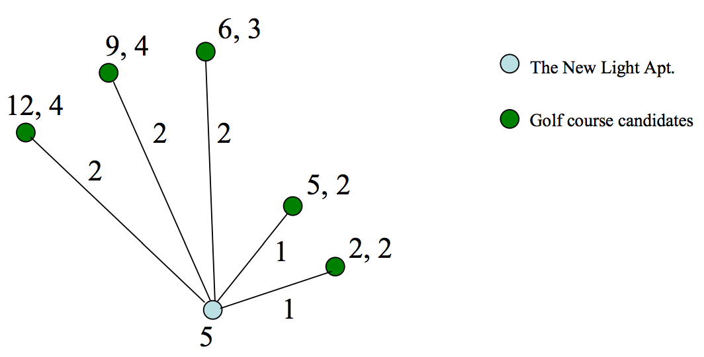
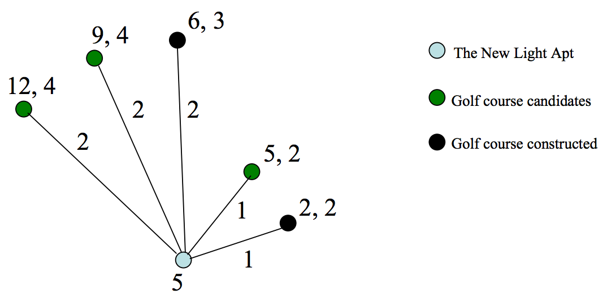

## 문제

We want to construct golf courses around the New Light, an apartment complex. Several candidates for golf courses have been investigated and now we know, for each candidate, its limited capacity which means the number of clients that it can hold, and its construction cost. The New Light Apartment has a number of clients who want to play golf. So, we want to choose some candidates of golf courses and construct them to satisfy all the clients at a time while minimizing the total cost. The total cost is the summation of clients’ total connection costs to the constructed golf courses and the construction costs for the constructed golf courses. Let’s see an example below.

The graph representing the connection between cadidates of golf courses and the New Light Apartment is of a star shpae. The New Light Apartment is placed at the center vertex. The other vertices are the locations of possible golf courses. The number beside the New Light Apartment is the number of clients who want to play golf in the apartment. The two numbers beside a golf course candidate are its construction cost and its capacity. Finally, the number beside an edge of the graph is the distance between the New Light Apartment and a golf course candidate. For the example above, the optimal solution which minimizes the summation of the connection cost and the construction cost of golf courses is like the following figure below. In the following figure, the construction cost for two golf courses to be constructed are 6 and 2, respectively. Two clients use the golf course with connection cost 1. The remaining three clients use the golf course which has connection cost 2. So the total construction cost of the golf courses is 6+2=8. And the total connection cost equals to 1+1+2+2+2=8. So the total cost is 8 + 8 = 16.

## 입력

Your program is to read from standard input. The input consists of T test cases. The number of test cases T (1 ≤ T ≤ 20) is given in the first line of the input. At the first line of each test case, a positive integer N (1 ≤ N ≤ 500), the number of candidates of golf courses, is given. At the second line of the each test case, a positive integer P (1 ≤ P ≤ 10,000), the number of clients, is given. From the third line of each test case, for each golf course, three positive integers, the distance from the New Light Apartment to the golf course candidate, the construction cost for the golf course, and the capacity of the golf course, are given in a line. There is a single space between the integers, and the integers are between 1 and 10,000, both inclusive. (See the sample input below. The first sample represents the example shown above.)

## 출력

Your program is to write to standard output. For each test case, print the minimum cost which minimizes the summation of total connection cost and total construction cost. The following shows sample input and output for two test cases.
