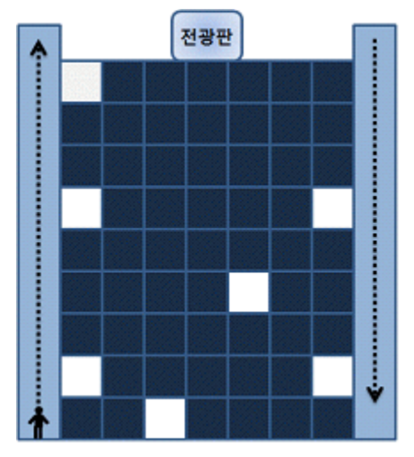

## 문제

A 씨는 어떤 회사 빌딩의 수위로 일하고 있다. A 씨는 밤 12 시가 되면 이 빌딩 사무실의 켜져 있는 모든 등과 건물 옥상에 있는 전광판을 소등한 후 퇴근한다. 그런데 이 빌딩은 특이한 구조로 이루어져 있다. 각 층에는 동일한 개수의 사무실이 일렬로 늘어서 있고, 건물 양편에 엘리베이터가 있다. 왼쪽에 있는 엘리베이터는 올라갈 때만 탈 수 있는 엘리베이터이고 오른쪽에 있는 엘리베이터는 내려갈 때만 탈 수 있는 엘리베이터이다. 전광판을 끄기 전에는 왼쪽에 있는 엘리베이터만 탈 수 있고, 끈 이후에는 오른쪽에 있는 엘리베이터만 탈 수 있다.

사무실 등은 왼쪽 엘리베이터를 타고 올라가면서 들러 소등할 수도 있고, 오른쪽 엘리베이터를 타고 내려오면서 들러 소등할 수도 있다. A 씨는 왼쪽 엘리베이터 1 층에서 출발하여, 소등하기 위해 이동해야 하는 거리를 최대한 줄이고 싶다. 수위실에서 올려다보면 창문을 통해 소등되지 않은 사무실을 한 눈에 알 수 있으므로, 소등을 시작하기 전에 이 정보를 가지고 소등 경로를 계획하려고 한다.

A 씨가 전광판과 사무실의 등을 끄기 위해 필요한 최소 이동 거리를 계산하는 프로그램을 작성하라. 단, 엘리베이터와 가장자리에 있는 사무실과의 거리나 각 인접한 사무실과의 거리를 1 로 가정한다. 또한 엘리베이터를 이용한 층간 이동 거리도 1 로 가정한다.

## 입력

입력은 표준입력(standard input)으로 주어진다. 입력의 첫 번째 줄에는 테스트케이스의 개수 T (1 ≤ T ≤ 20) 가 주어진다.

각 테스트케이스 별 입력은 다음과 같이 구성된다.

* 1 번째 줄: 빌딩의 높이(옥상을 제외한 층의 수) F (1 ≤ F ≤ 30), 한 층에 있는 사무실의 수 R (1 ≤ R ≤ 30)와 등이 켜져 있는 사무실의 수 N (0 ≤ N ≤ F×R) 이 입력된다.
* 2~N 번째 줄: 각 줄에 등이 켜져 있는 한 개의 사무실 위치가 입력된다. 사무실 위치는 층 번호 a (1 ≤ a ≤ F) 와 호수 b (1 ≤ b ≤ R) 로 두 개의 정수가 주어지며 빈 칸 하나로 구분된다. (사무실 호수는 왼쪽부터 차례로 1, 2, … , R 로 메겨진다.)

입력에는 같은 방(같은 층, 호수)이 두 개 이상 주어지지 않는다고 가정해도 좋다.

## 출력

출력은 표준입력(standard output)으로 출력한다. 각 테스트케이스에 대하여, 소등하기 위해 이동해야 하는 최소 거리를 한 줄에 하나씩 출력한다.

## 힌트

이 문제의 원본 문제에는 "전광판을 끄기 전에는 왼쪽에 있는 엘리베이터만 탈 수 있고, 끈 이후에는 오른쪽에 있는 엘리베이터만 탈 수 있다." 라는 말이 없다. 이 조건이 있어야 공식 풀이가 맞다.
