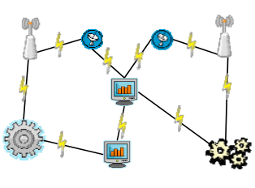
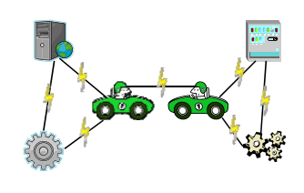
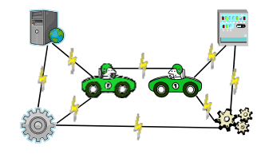

## 문제

The Large veHicle Collider (LHC) is the world’s largest and highest-energy vehicle accelerator complex, intended to collide two vehicles with very high kinetic energy. Its main purpose is to examine the safety model on vehicle structure. This would supply crucial information in missing link in the vehicle safety Standard Model and explain how other elementary parts interact in emergency situation.

Due to safety concerns, LHC uses vehicles with electric motors. And LHC experiments require huge electric power. Thus, LHC needs special electronic supply system. The LHC headquarter decided to build a doubly linked electric line network. An electric line network is said to be doubly linked if any two facilities are directly, or indirectly connected even though any one electric line is out of order.

The LHC headquarter wants to install some extra electric lines to make the electric line network doubly linked. Of course, they do not want to install any redundant lines. For a given electric line network, how many electric lines are required to make the network doubly linked?

Write a program to compute the smallest number of required electric lines to make a given network doubly linked. You can assume that all facilities in a given network are connected by electric lines.

  
Figure (a)

  
Figure (b)

  
Figure (c)

Figure (a) shows a doubly linked network. Figure (b) is not doubly linked because removing the line between two cars makes the network disconnected. We need to install one more line to make the network doubly linked as shown in Figure (c).

## 입력

Your program is to read the input from standard input. The input consists of T (1 ≤ T ≤ 20) test cases. The number of test cases T is given in the first line of the input. Each test case starts with a line containing an integer N and M (1 ≤ N ≤ 1000, 1 ≤ M ≤ 100,000) indicating the number of facilities of LHC and the number of electric lines already installed between facilities of LHC, respectively. From the next line, M already-installed electric lines are given one by one in each line as the form ‘a b’, where a and b (0 ≤ a, b ≤ N -1) are the integers indicating facilities.

In the input, there are no multiple electric lines directly connecting two facilities. But it does not mean that installing multiple electric lines between two facilities is forbidden.

## 출력

Your program is to write to standard output. For each test case, print out in one line the minimum number of electric lines required to make the given electric line network doubly linked.
