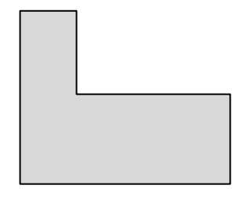
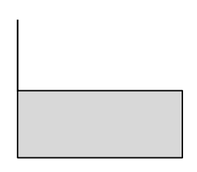
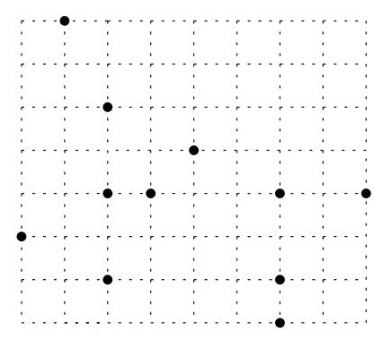
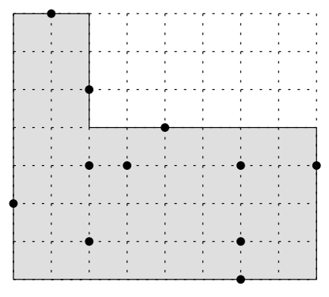

## 문제

An L-shape is an axis-aligned, rectilinear hexagon with one reflex corner such that it misses only the top-right corner of its smallest bounding rectangle. See the Figures (a) and (b) for examples. Notice that it may degenerate to have three collinear corners like Figure (b).

  
Figure (a)

  
Figure (b)

For a given set of N points in the plane, it is said that an L-shape covers the points if each of the points lies in it or on its sides. You are to write a program that returns the area of the smallest Lshape that covers all input points.

  
Figure (c)

  
Figure (d)

Figure (c) shows a set of points and the minimum-area L-shape covering the set of points is shown in Figure (d).

Note that the resulting area may be zero and the points given as input may contain more than one points with the same coordinates.

## 입력

Your program is to read the input from standard input. The input consists of T (1 ≤ T ≤ 20) test cases. The number of test cases T is given in the first line of the input. Each test case is given as the number N (1 ≤ N ≤ 50,000) of points and the points themselves; N is given as an integer in the first line and the two coordinates of each points is given by two integers between -30,000 and 30,000 separated by a single space line by line from the second line. (See the sample input below. The second sample represents the example shown in Figures (c) and (d).)

## 출력

Your program is to write to standard output. For each test case, print out the area of the smallest L-shape covering the given points, in one line.
