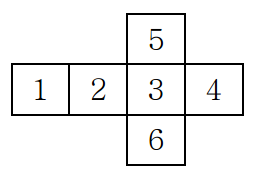
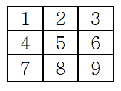
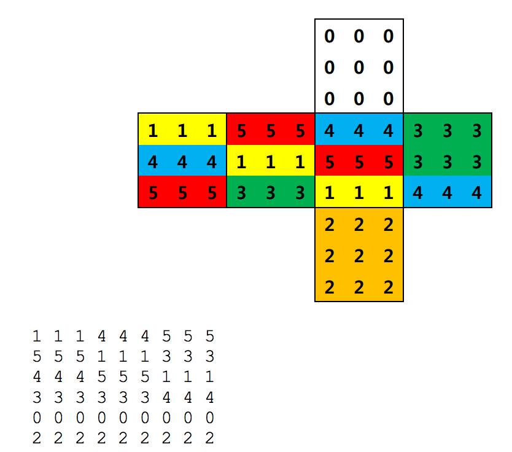

## 문제

루빅스 큐브(Rubik’s Cube)는 조각가이자 건축학 교수인 에르노 루빅(Ernő Rubik)이 개발한 퍼즐로, 27 개의 작은 정육면체들로 이루어진 큰 정육면체로 이루어져 있으며 작은 정육면체의 각 면은 정해진 6 개의 색깔이 각각 칠해져 있다. 각 방향으로 돌아가게끔 만들어져 있어, 흩어진 각 면의 색깔을 같은 색깔로 맞추는 퍼즐이다.

새내기 대학생 B 군은 루빅스 큐브 매뉴얼을 보다가 다음과 같은 문제를 생각해 내었다. 루빅스 큐브의 겉 생김새들이 주어졌을 때, 이들이 사실은 동일한 큐브를 서로 다른 시점에서 본 것임을 어떻게 판단해야 할까? B 군을 도와 이 문제를 해결해 보도록 하자.

큐브는 다음과 같이 기술된다. 큐브의 여섯 면에 대한 정보는 다음과 같은 순서로 주어진다.

각 면에 대한 정보는 다음과 같은 순서로 주어진다.

따라서 다음 펼친 그림과 같은 큐브는

와 같이 나타낼 수 있다.

2 개의 큐브의 겉 생김새가 주어졌을 때, 두개의 겉 생김새가 동일한 큐브를 서로 다른 시점에서 본 것인지를 판단하는 프로그램을 작성하시오.

## 입력

입력은 표준입력(standard input)을 통해 받아들인다. 입력의 첫 줄에는 테스트 케이스의 개수 T (1 ≤ T ≤ 20)가 주어진다. 그 다음 줄부터 T 개의 테스트 케이스가 주어지게 된다.

각 테스트케이스당 2 개의 큐브의 겉 생김새가 주어진다. 큐브의 겉 생김새는 0 부터 5 까지의 각 색상을 의미하는 6 가지의 숫자가 각각 6 번씩 등장하는, 전부 36 개의 숫자로 주어진다. 그 순서는 위에서 설명한 바를 따르며, 입력으로 주어지는 모든 숫자들은 공백문자로 구분되어 있다.

입력으로 주어지는 모든 큐브들은 루빅스 큐브의 조작을 통해 6 개의 면을 모두 각각 같은 색깔로 맞출 수 있다.

## 출력

출력은 표준출력(standard output)을 통하여 출력한다. 각 테스트케이스 별로 한 줄에 하나씩 결과를 출력하시오. 입력으로 주어진 두 개의 겉 생김새가 동일한 큐브를 서로 다른 시점에서 본 것이라면 ‘Y’, 그렇지 않다면 ‘N’을 출력하시오.
