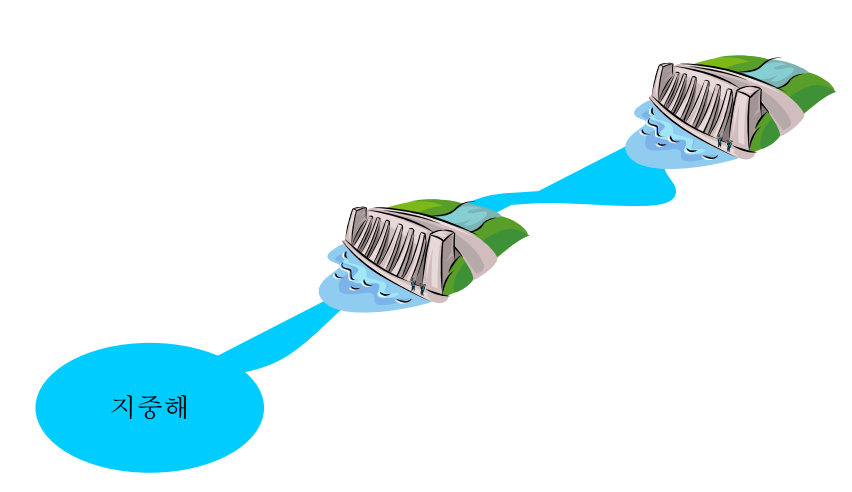

## 문제

6,650 km 에 달하는 나일강은 에티오피아, 수단, 이집트 등 10 개 나라를 거쳐 지중해까지 흘러간다. 아프리카 중부 고원의 비는 7 월에서 10 월에 걸쳐 집중되는데 해마다 범람하는 나일강을 사람의 힘으로 막아보고자 1902 년 아시우트, 아스완을 시작으로 여러 개의 댐을 건설하였다.

같은 지류에 있는 댐들은 서로 저수를 하거나 방수를 하게 되면 서로의 수위에 영향을 미치게 되어 서로 긴밀한 협력 속에서 조작되어야 한다. 매년 계속되는 폭우에 대비하여 아프리카 기상 관측 기구에서는 비교적 정확한 폭우를 예보하고 있는데, 이를 토대로 댐 관리인들이 진땀을 빼며 댐을 관리하고 있다. 비가 올 때마다 방수를 하면 되지만 댐의 용량에 따라 며칠 버틸 수 있기도 하고, 방수를 한 번 할 때마다 비용이 너무 많이 들어서 방수, 저수 관리하는 것이 쉽지만은 않다.

폭우 정보가 정확하다는 가정하에 같은 지류에 있는 댐들이 하나도 범람하지 않으면서 전체 방수 비용(모든 댐의 방수 비용의 합)을 최소화하는 프로그램을 작성하시오. 항상 하나의 댐도 범람하지 않으면서 댐들을 관리할 수 있다고 가정하자.

하나의 지류에 있는 댐들에 대해서만 고려하며 각 댐들은 용량에 따라 각각의 방수 비용이 있다(댐의 문을 열어 방수를 하며 한번 댐의 문을 연 다음엔 문을 닫아서 바로 저수 작업에 들어간다). 인접한 댐 사이의 거리에 따라 상류의 댐이 방수한 물이 다음 댐에 도달할 때까지 걸리는 시간이 주어지며 안전한 수위 유지를 위해서 위쪽 댐이 방수한 물이 도달한 댐은 무조건 방수를 시작한다. 폭우에 대한 기상 예보는 각 댐의 용량을 고려하여 각 댐에 내려지며 언제부터 언제까지 방수를 해서 그 댐의 물이 지중해까지 빠져나가야 하는 지를 알려준다. 예를 들어 댐 1 에 기상예보가 [t1, t2]로 주어지면 댐 1 은 t1과 t2 사이에 반드시 방수를 해야 하며 그 물은 t2 이전에 지중해로 흘러가야만 한다. 각 댐에서 방류하는 데에 걸리는 시간은 고려하지 않으며 단지 댐과 댐 사이에 물이 흘러가는 데에 걸리는 시간만을 고려한다고 가정한다.

## 입력

입력은 표준입력(standard input)을 통해 받아들인다. 입력의 첫 줄에는 테스트 케이스의 개수 T (1 ≤ T ≤ 20)가 주어진다. 각 테스트케이스의 첫 줄에는 댐의 수 N (1 ≤ N ≤ 10)이 주어지고 그 다음 N 줄에 걸쳐 각 댐에 대한 정보가 한 줄씩 주어진다. 각 댐에 대한 정보로는 방수 비용 Ci ( 1 ≤ i ≤ N, 1 ≤ Ci ≤ 10), 그 다음 댐까지 물이 흘러가는데 걸리는 시간 di ( 1 ≤ i ≤ N, 1 ≤ di ≤ 10), 기상예보의 수 k ( 1 ≤ k ≤ 10), k 개의 기상예보 [ti1, ti2]가 (1 ≤ i ≤ k) 주어진다. 첫 번째 댐이 가장 상류에 있으며 dN은 N 번째 댐에서 지중해까지 물이 흘러가는데 걸리는 시간이다.

## 출력

출력은 표준출력(standard output)을 통하여 출력한다. 각 테스트 케이스에 대하여 하나의 댐도 범람하지 않도록 하는 최소의 방수 비용을 한 줄에 하나씩 출력하시오.
