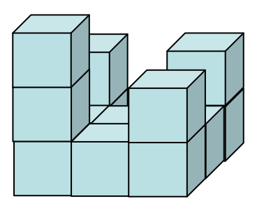
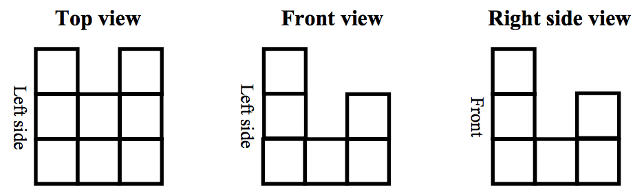

## 문제

The above figure shows a pile of cubes in an isometric view, having 8 cubes in the first floor, 4 in the second floor and 1 in the third. When we see this pile of cubes from top, front, and right side, we will obtain the following three images, called the top view, the front view, and the right side view. Each such view is seen without rotating the pile itself.

On the other hand, when we are given the three views as images, we could guess the original pile of cubes that would have been seen. Indeed, there can be many piles of cubes that are seen the same as each other from top, front and right side.

You are to program an algorithm computing the maximum possible number of cubes in those piles which look the same as the given three views.

Note that possibly the given three views may not be realizable by any pile of cubes. Also, we assume that we are playing with cubes on Earth where the Gravity affects, not in space. Therefore, each cube lies on ground or on another cube in a feasible pile of cubes. Your program should, of course, be able to check the feasibility of input view images.

## 입력

Your program is to read from standard input. The input consists of T test cases. The number of test cases T (1 ≤ T ≤ 20) is given in the first line of the input. At the first line of each test case, a positive integer N(1 ≤ N ≤ 300) is given, which determines the size of each view image as N by N. From the next line, the top view, the front view, and the right side view are given by three N by N 0-1 matrices, where 0 denotes no cube is seen in the position and 1 denotes a cube is seen. Each row of an input matrix is separated by line and each entry in a row is separated by a single space. (See the sample input below. The first sample represents the above shown example.)

## 출력

Your program is to write to standard output. For each test case, print out your output in one line. The output prints the maximum possible number of cubes included in a pile of cubes which realize the given three views. If the given input is not realizable by any pile of cubes, then the output should be ‘-1’.
