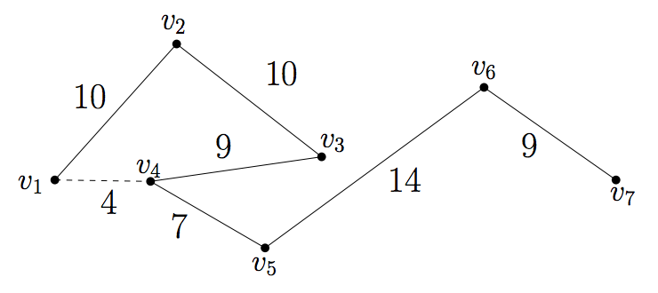

## 문제

Consider a geometric graph G = (V, E) which is just a path of N vertices. More precisely, V = {v1, v2, … , vN} and E = {vivi+1 | 1≤ i ≤ N-1}. Also, in a geometric graph each vertex in V is represented by a point on the plane and each edge in E by a straight line segment connecting two points corresponding to two vertices.

If we regard G as a road network on our plane so that we are allowed to move only on the network, then it will make some detours when moving on G compared to the direct path between two points. To measure such quantity, define the detour D(G, vi , vj) between two vertices vi , vj in V with i < j as follows:

D(G, vi , vj) = dG(vi , vj) / d(vi , vj),

where dG(vi, vj) = d(vi , vi+1) + d(vi+1, vi+2) + … + d(vj-1, vj) and d(·, ·) denotes the Euclidean distance function. Further, we denote by D(G) the maximum detour of geometric graph G among all the pairs of vertices of G:

D(G) = max {D(G, v, w) | v, w ∈V, v ≠ w}.

In figure above, a geometric graph G is seen as a path of 7 vertices {v1, ..., v7}. Numbers indicate the Euclidean distances between pairs of vertices; for instance, d(v1, v2) = 10 and d(v1, v4) = 4. Here, you can see that D(G, v1, v4) = dG(v1, v4) / d(v1, v4) = (10 + 10 + 9) / 4 = 29/4.

In this problem, you will be given a sequence of N points and two consecutive points are supposed to be connected by an edge which is represented by a straight line segment. Then, you are to compute the maximum detour D(G) of a given geometric graph G.

## 입력

Your program is to read from standard input. The input consists of T (1 ≤ T ≤ 20) test cases. The number T of test cases is given in the first line of the input. Each test case contains the number N (2 ≤ N ≤ 10000) of vertices of a given geometric graph G (which is a path) at first line, and the coordinates of the vertices following line by line. The coordinates of each vertex are bounded in the range [-10000...10000]. All the primitive input values are given as integers and integers in a line are separated by a single space.

## 출력

Your program is to write to standard output. Print exactly one line for each test case with the maximum detour D(G) of G. The output should contain only two decimal places just by rounding off. Note that G may be possibly self-intersected by its edges, and if D(G) value is at least 1000, you MUST print out “TOO LARGE”, instead of the value of D(G).
