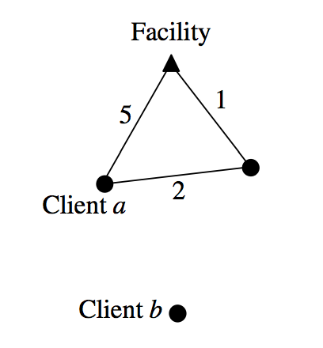

## 문제

One facility and several clients are located in some vertices of a weighted graph G = (V, E). Each client j has some nonnegative demand dj and a nonnegative priority value pj that indicates the importance of that client. The servicing cost of a client j is cj ⋅ dj , where cj is the shortest distance of j from the facility vertex in graph G to a client j . For example, in the figure below, the servicing cost of the client a is a 3⋅da, where da is the demand of the client a. The servicing cost of the client b in the figure is infinite because the there is no path from the client b to the facility in the given graph.

You have to write a program that selects a subset of the client set such that total servicing cost of all the clients in this subset is bounded by a nonnegative budget B and the total priority value of all clients in this subset is maximized.

## 입력

Your program is to read from standard input. The input consists of T (1 ≤ T ≤ 20) test cases. The value of T is given in the first line of the input. Each test case starts with a positive integer N (1 ≤ N ≤ 100) indicating the number of vertices in the graph. You can assume that the vertices are numbered from 0 to N – 1 and vertex 0 contains the facility. The next line contains an integer M (0 ≤ M ≤ 100) indicating the number of clients. Next M lines contain the description of each client. Each line contains three integers – vertex index, demand and priority value of the client. Each integer has ranges of [0,100]. After the description of M clients, the next line contains an integer B (0 ≤ B ≤ 100) indicating the total budget. The next line contains an integer L (0 ≤ L ≤ 100) indicating the number of edges. Next L lines describe the edges. Each line contains three integers – first two integers indicate the two vertices incident to the edge and the third integer indicates its cost. Again each integer is within the range of [0,100].

## 출력

Your program is to write to standard output. Print exactly one line for each test case with the total priority value of the clients selected for the service.
