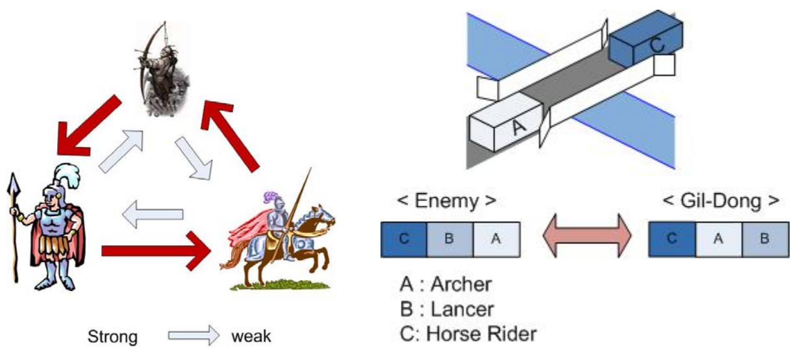

## 문제

A boy named Gil-Dong is playing Computer Strategy game these days. To win this game, he has to find out opponent’s formation and then, he must organize his formation with appropriate soldiers. In this game there are three sorts of soldiers, which are archer, lancer, and horse rider units. An archer unit can beat a lancer unit, and a lancer unit can beat a horse rider unit, and a horse rider unit can beat an archer unit. Your task is to make a program providing Gil-Dong a winning formation of the game with the minimum number of soldiers.

Important Notes:

1. Every soldier can only attack forward, and can’t attack the side.
2. Gil-Dong’s soldiers are moving from the right to the left, and the opponent’s soldiers are moving from the left to the right as the right figure shown.
3. When a soldier of Gil-Dong fight with the same kind soldier of the opponent, Gil-Dong’s soldier should be beaten because Gil-Dong’s soldiers are not really well trained.

## 입력

Your program is to read from standard input. The input consists of T (1≤T≤15) test cases. The number T of test cases is given in the first line of the input. Each test case consists only of one formation of soldiers represented by a string of {A, B, C} in each following line, where ‘A’ denotes a archer unit, ‘B’ denotes a lancer unit, ‘C’ denotes a horse rider unit, respectively. The length of each test case does not exceed 80. You shoud remember that the last soldier of the given formation is involved in the first engagement with the first soldier of Gil-Dong’s formation.

## 출력

Your program is to write to standard output. Print exactly one line for each test case with a winning formation of the minimum possible length.
