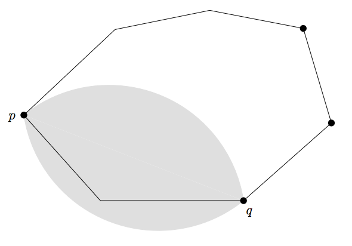

## 문제

In an exhibition room of the National Museum, a knife which is 5000 years old is on display. The very ancient knife is indeed one of the most valuable and expensive relics in the National Museum. Thus, a fence whose shape is a convex polygon is put around the knife to protect it from spectators. But two or three watchmen always need to guard it, and this costs the Museum a lot.

From this aspect, the National Museum decided to adopt a high-tech to automatically protect the knife and the fence around it. The answer is putting several “sensors” to watch the fence. If sensors see the fence properly, the Museum is able to watch the fence and then its interior clearly. The sensor chosen by the National Museum has following properties:

1. A sensor doesn’t work alone, and does work together with another.
2. A pair of sensors located at points p, q can see all the points x such that angle ∠pxq is at least α and at most 360o - α, where 0o < α ≤ 180o.
3. Each sensor should be located on the floor and on the boundary of the fence. If a point on the floor is watched, all points directly above the point are assumed to be watched, too.

The National Museum wants to know how many sensors are necessary for proper watch. Your task is to devise and implement an algorithm for finding the minimum number of sensors to watch the fence properly, when a convex polygon (fence) and a value of α are given. The figure below illustrates a fence and a proper placement of the minimum number of sensors when α = 120o, and all the points only in the gray region are watched by a pair of sensors p and q.

You can assume that there are no three consecutive vertices that are collinear.

## 입력

Your program is to read from standard input. The input consists of T (1 ≤ T ≤ 20) test cases. The number T of test cases is given in the first line of the input. Each test case contains of α value (0 < α ≤ 180) and the number N (3 ≤ N ≤ 10000) of vertices of a given convex polygon at first line, and the coordinates of the vertices following line by line counter-clockwise. The coordinates of each vertex are bounded in the range [-10000...10000]. All the primitive input values are given as integers and integers in a line are separated by a single space.

## 출력

Your program is to write to standard output. Print exactly one line for each test case with the minimum possible number of sensors to watch the boundary of the given convex polygon properly.
