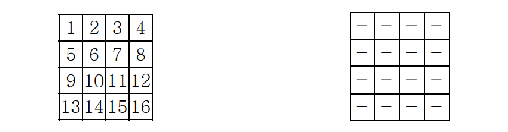
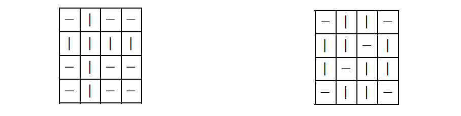

## 문제

어떤 금고가 N × N 개의 격자에 모두 한 개씩의 손잡이를 가지고 있다. 모든 손잡이는 수직(|), 또는 수평(-), 이 두 가지 상태밖에 없으며 이 손잡이를 돌려서 수직, 수평으로 만들 수 있다.

각 손잡이의 번호는 왼쪽에서 오른쪽으로, 위에서부터 아래로 내려가면서 1 번부터 N2번까지 아래 왼쪽그림과 같이 지정되어 있다. 그리고 금고의 초기상태는 오른쪽 그림과 같이 모두 손잡이가 수평(-)으로 되어 있다. 그리고 모든 손잡이가 수평으로 되어있을 때만 금고문은 열린다.

우리는 이 금고문이 열려있는 초기상태에서 다음과 같이 문을 잠근다. 어떤 손잡이를 잡고 그 방향을 바꾼다. 즉 수평(-)인 경우에 돌리면 수직(|)이 되고, 수직인 경우에는 수평이 된다. 그리고 중요한 한 가지 특징은 선택한 손잡이와 같은 행과 열에 있는 모든 손잡이의 방향은 바뀌게 된다.

예를 들어 초기상태에서 손잡이 6 번을 돌리면 아래 왼쪽 그림과 같은 상태가 되고 그 상태에서 다시 손잡이 11 번을 돌리면 오른쪽 그림과 같은 상태가 된다.

이 문제는 잠긴 금고를 열기 위해서 최소 몇 번 손잡이를 돌려야 하는지를 출력하는 것이다. 즉, 모든 손잡이를 수평으로 만들기 위해 최소 몇 번 손잡이를 돌려야 하는지를 계산하는 것이다.

## 입력

입력은 표준입력(standard input)을 통해 받아들인다. 입력의 첫 줄에는 테스트 케이스의 개수 T (1 ≤ T ≤ 20)가 주어진다. 각 테스트 케이스는 첫째 줄에 금고의 크기를 나타내는 N 이 2 이상 20 이하의 짝수로 주어진다. 그 다음 이어지는 N개의 줄에는 금고의 상태가 나타난다. 각 줄에는 한 줄에 N개씩 H 또는 V 문자가 하나의 공백을 두고 나타난다. 여기에서 H는 수평상태의 손잡이를 V는 수직상태의 손잡이를 나타낸다.

## 출력

출력은 표준출력(standard output)을 통하여 출력한다. 각 테스트케이스에서 금고를 열기 위해 손잡이를 돌려야 하는 최소 회수를 출력한다.
