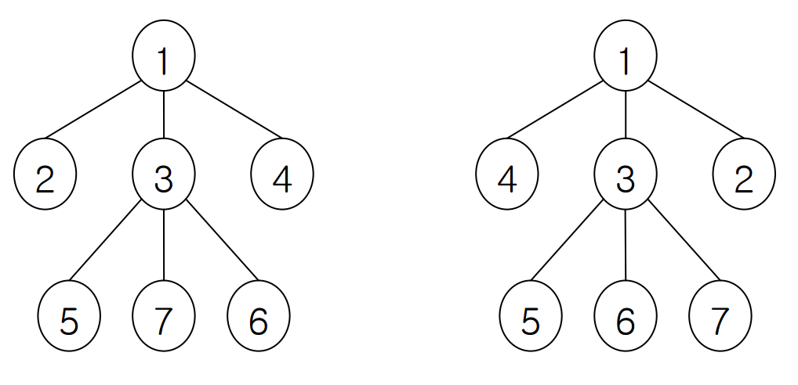

## 문제

We consider a tree T = (V, E) where V is a set of vertices and E is a set of edges. A vertex adjacent to v is called a neighbor of v in T , and we denote the set of neighbors of v in T by N(v). A labeling of a tree T is defined as a one-to-one and onto function f : V → {1, 2, ..., |V|}. For two labeling f and g, if f(u) = g(v) and {f(u') | u' ∈ N(u)} = {g(v') | v' ∈ N(v)}, then we say that v and g are equivalent, or f is equivalent to g . Note that basically a labeling f of T is equivalent to f itself. The figure below shows two equivalent labeling; you can easily check the equivalency.

Your task is to devise and implement an efficient algorithm for counting the number of equivalent labeling to a labeling f of T when you are given a tree T and a labeling f. Since f is equivalent to f itself, you must not miss f itself when counting equivalent labeling of f.

## 입력

Your program is to read from standard input. The input consists of T (1 ≤ T ≤ 20) test cases. The number T of test cases is given in the first line of the input. Each test case consists of the number N (1 ≤ N ≤ 1000) of vertices of an input tree in the first line. Each of following N-1 lines contains two integers 1 ≤ i, j ≤ N, which represents an edge of our input tree connecting vertex i and vertex j. The (N + 1)-st line contains N integers representing a labeling, that is, the ith number of (N+1)-st line means the label of vertex i. All the integers are separated by a single space.

## 출력

Your program is to write to standard output. Print exactly one line for each test case with the number of equivalent labeling.
