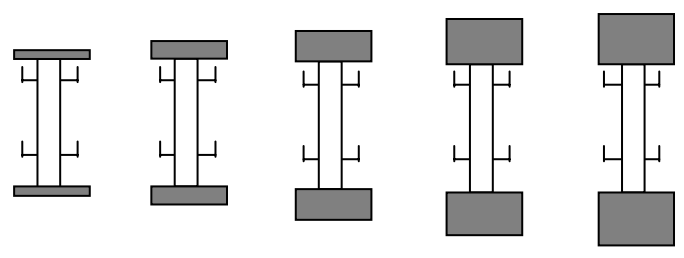
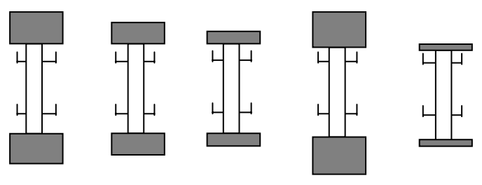

## 문제

건강대학교 체력단련장에는 각기 다른 무게를 가진 N 개의 역기들이 고정대 위에 놓여 있다. 아침에는 체력단련장 이용자들의 편의를 위하여 다음과 같이 무게 순으로 정렬하여 둔다. (그림은 N 이 5 인 경우)

하지만, 체력단련장이 문을 닫을 때가 되면, N 개의 역기들은 무게 순과는 무관하게 어지럽게 놓여져 있다. 다음은 그러한 예 중의 하나이다.

체력단련장 관리자인 현우는 체력단련장의 문을 닫으면서 어지럽게 놓인 N 개의 역기들을 무게의 오름차순으로 정렬하는 일을 담당하고 있다. 역기의 무게가 만만치 않기 때문에 현우는 들어 옮기는 역기의 무게의 합을 최소로 하여 정렬하고자 한다. 안전을 위해서 현우는 한 번에 두 개의 역기를 들어 옮기지는 않는다. 이때, 역기를 들어 옮기는 방법은 다음과 같이 세 가지가 있다.

* 고정대에 놓인 역기를 체력단련장의 바닥에 내려놓는다.
* 고정대에 놓인 역기를 빈 고정대로 옮긴다.
* 체력단련장의 바닥에 놓인 역기를 빈 고정대로 옮긴다.

예를 들어 세 개의 역기가 고정대 위에 차례로 5kg, 4kg, 1kg 의 순으로 놓여 있다고 하자. 만약 다음과 같은 순서로 역기들을 정렬한다면 옮기는 역기 무게의 합은 7kg 이 된다. 먼저 1kg 의 역기를 체력단련장의 바닥으로 옮기고, 1kg 역기가 놓여 있던 빈 고정대 위로 5kg 의 역기를 옮긴다. 마지막으로 바닥에 내려놓았던 1kg 의 역기를 처음에 5kg 의 역기가 놓여 있던 고정대로 옮긴다.

## 입력

표준 입력(standard input)을 통하여 입력한다. 입력은 T (1 ≤ T ≤ 10) 개의 테스트 케이스로 이루어진다. 테스트 케이스의 수 T 가 입력의 첫째 줄에 주어진다. 각각의 테스트 케이스는 두 줄로 이루어져 있는데, 첫 줄에 역기의 개수 N 이 1,000 이하인 양의 정수로 주어지고, 다음 줄에 역기들의 무게가 주어진다. 역기들의 무게는 서로 다르다.

## 출력

표준 출력(standard output)을 통하여 출력한다. 각각의 테스트 케이스에 대해서 오름차순으로 역기들을 정렬하기 위하여 옮겨야 하는 무게의 합의 최솟값을 한 줄에 하나씩 출력한다.
