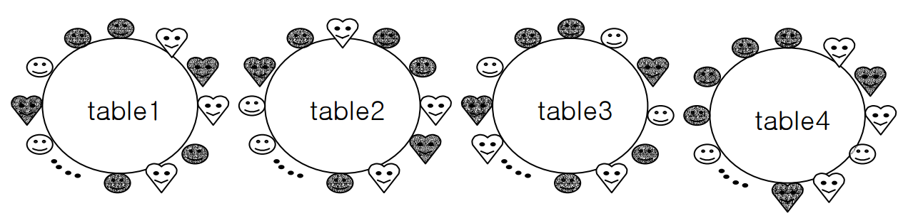
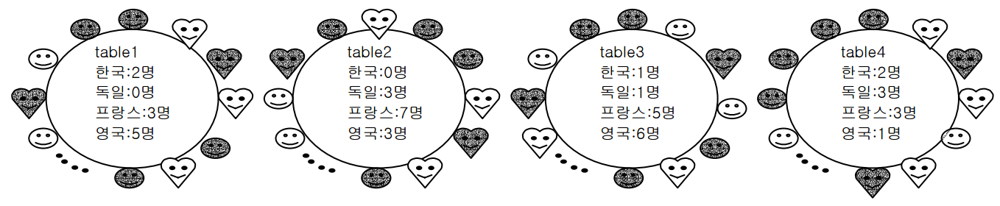

## 문제

2006 년도 월드컵 4 강에 한국, 독일, 프랑스, 영국 팀이 진출하였다. FIFA 는 이들의 4 강 진출을 축하하기 위하여 저녁 만찬 자리를 마련하였다. 각 팀의 선수와 가족들이 모두 참석한 만찬이 열리는 식당엔 4 개의 테이블이 있다. 참석자들은 소속 팀에 관계없이 4 개의 테이블에 섞여서 식사를 하고 있다.

만찬 중의 행사 진행을 위해 각 테이블 별로 한 나라의 소속팀 선수와 가족만 않도록 하려고 한다. 문제는 행사 진행에 알맞게 자리를 잡기 위하여 테이블간의 이동 인원을 최소화하는 것이다. 각 테이블의 자리는 모든 팀 선수들을 수용하기에 충분한 만큼 존재한다.

## 입력

표준 입력(standard input)을 통하여 입력한다. 입력은 T 개의 테스트 케이스로 이루어진다. 테스트 케이스의 수 T 는 입력 파일의 첫 행에 주어진다. 각각의 테스트 케이스는 16 개의 정수로 이루어진다. 처음 4 개의 숫자는 1 번 테이블에 앉은 한국, 독일, 프랑스, 영국 팀 소속 인원의 숫자이며, 이하 12 개의 숫자도 각각 2,3,4 번 테이블에 앉아 있는 각 국가별 인원수를 나타낸다. T 는 1 ≤ T ≤ 5 의 범위를 갖고, 각 테스트 케이스마다 주어지는 16 개의 정수의 합은 10,000 을 초과하지 않는다.

예를 들어 2, 1, 3, 5, 0, 2, 7, 3, 1, 1, 5, 6, 2, 3, 3, 1 과 같은 입력은 다음 그림과 같은 의미이다.

1 번 테이블에 앉은 영국 팀 소속 인원은 5 명, 2 번 테이블에 앉은 프랑스팀 소속 인원은 7 명, 3 번 테이블에 앉은 독일 팀 소속 인원은 3 명, 4 번 테이블에 앉은 한국 팀 소속 인원은 2 명이라고 해석할 수 있다. 만약 1 번 테이블에 앉은 독일 사람 1 명이 2 번 테이블로 자리를 옮긴다면 테이블 상태는 다음과 같이 바뀔 것이다.

## 출력

표준 출력(standard output)을 통하여 출력한다.각각의 테스트 케이스에 대해서 정확하게 한 줄의 결과를 출력해야 한다. 이 결과는 각 테이블에 단일 국가의 소속팀 선수와 가족만을 포함시키기 위한 이동 인원의 최솟값을 의미한다.
