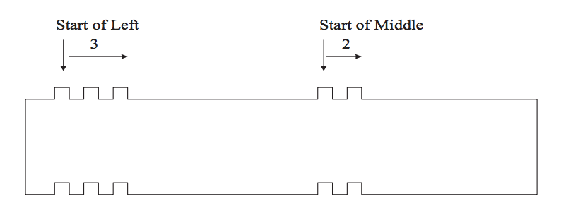

## 문제

Michael The Kid receives an interesting game set from his grandparent as his birthday gift. Inside the game set box, there are n tiling blocks and each block has a form as follows:

Figure 1: Michael’s Tiling Block with parameters (3,2).

Each tiling block is associated with two parameters (ℓ, m), meaning that the upper face of the block is packed with ℓ protruding knobs on the left and m protruding knobs on the middle. Correspondingly, the bottom face of an (ℓ, m)-block is carved with ℓ caving dens on the left and m dens on the middle.

It is easily seen that an (ℓ, m)-block can be tiled upon another (ℓ, m)-block. However, this is not the only way for us to tile up the blocks. Actually, an (ℓ, m)-block can be tiled upon another (ℓ', m')-block if and only if ℓ ≥ ℓ' and m ≥ m'.

Now the puzzle that Michael wants to solve is to decide what is the tallest tiling blocks he can make out of the given n blocks within his game box. In other words, you are given a collection of n blocks B = {b1, b2, . . . , bn} and each block bi is associated with two parameters (ℓi, mi). The objective of the problem is to decide the number of tallest tiling blocks made from B.

## 입력

Several sets of tiling blocks. The inputs are just a list of integers. For each set of tiling blocks, the first integer n represents the number of blocks within the game box. Following n, there will be n lines specifying parameters of blocks in B; each line contains exactly two integers, representing left and middle parameters of the i-th block, namely, ℓi and mi. In other words, a game box is just a collection of n blocks B = {b1, b2, . . . , bn} and each block bi is associated with two parameters (ℓi, mi).

Note that n can be as large as 10000 and ℓi and mi are in the range from 1 to 100. An integer n = 0 (zero) signifies the end of input.

## 출력

For each set of tiling blocks B, output the number of the tallest tiling blocks can be made out of B. Output a single star ‘\*’ to signify the end of outputs.
