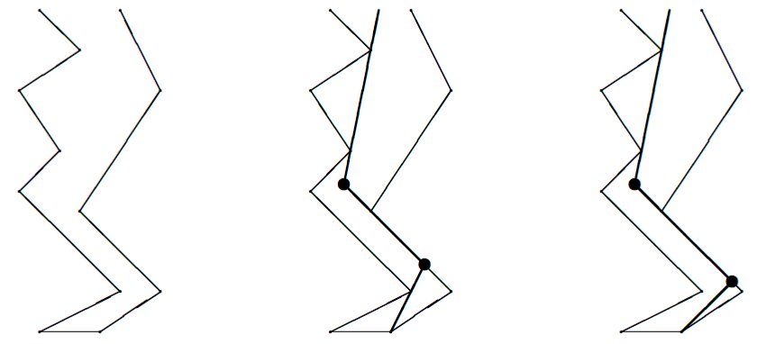
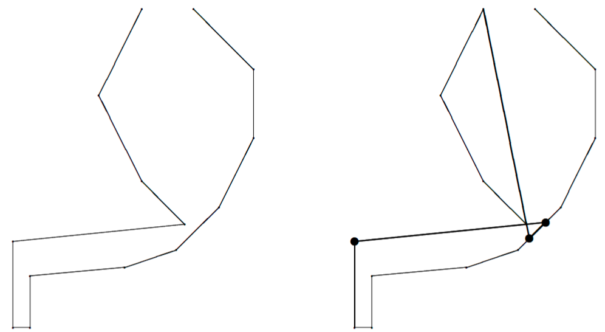

## 문제

A plumber has been hired to build an air pipe through a mineshaft from the bottom to the surface. The mineshaft was built without modern technology, so it winds its way up through the earth. Because it is very time consuming to bring the tools necessary to bend the pipe below the surface, the plumber wants to minimize the number of bends in the pipeline.

For example, for the mineshaft in the first picture below, the minimal number of bends in a pipeline from the bottom to the surface is two. Different optimal solutions exist, one of which is shown in the second picture. The bullets indicate the bends in the pipeline.

The two walls of the mineshaft are formed by sequences of straight segments. The numbers of segments in the two sequences may be different. Further, the horizontal distance between the walls of the mineshaft may vary, but is always positive. Both walls start at the same level and end at the same level.

On the way from the bottom of the mineshaft to the surface, the level (the y-coordinate) increases with every segment of a wall. Hence, the mineshaft does not have horizontal plateaus or ‘ceilings’, and at no point does it go back down again.

For the purpose of this task, you may assume the diameter of the pipeline to be 0. At no point may the pipeline cross the walls. In order to attach the pipeline firmly to the wall, each segment of the pipeline has to touch the walls at (at least) two different places. However, the bending points of the pipeline are weak. They cannot be used to attach the pipeline to the walls. The end points of the pipeline, though, at the bottom and the top of the mineshaft, may be used to attach a segment to the walls.

Hence, the solution in the third picture above (also having two bends) is not allowed, because the lowest segment of the pipeline can be attached to the walls at only one place: at the bottom of the right wall.

The pipeline must start anywhere at the bottom of the mineshaft, and must end anywhere on the imaginary line between the top of the left wall and the top of the right wall. Note, however, that the endpoints of the pipeline may only be used to attach the pipeline, if they touch a wall. In particular, the endpoint at the bottom cannot be attached to any position at the bottom which is not the bottom of a wall.

Finally, the angle that the pipeline makes at a bending point can take any value satisfying −180° < α < 180° and (of course) α ≠ 0.

Note that sometimes it may be useful to have the pipeline intersect with itself. For example, in the mineshaft below, this is needed to get from the bottom to the top of the mineshaft with only three bends.

## 입력

The first line of the input file contains a single number: the number of test cases to follow. Each test case has the following format:

* One line with one integer N1 (2 ≤ N1 ≤ 25): the number of points describing the left wall of the mineshaft.
* N1 lines with the coordinates of the points describing the left wall of the mineshaft, from the bottom to the top. The ith line contains two integers xi and yi (−1,000 ≤ xi ≤ 1,000 and 0 ≤ yi ≤ 1,000) separated by a single space: the x- and y-coordinate of the point, respectively.

The y-coordinates are monotonically increasing: y1 < y2 < … < yN1.

* One line with one integer N2 (2 ≤ N2 ≤ 25): the number of points describing the right wall of the mineshaft.
* N2 lines with the coordinates of the points describing the right wall of the mineshaft, from the bottom to the top. The ith line contains two integers x′i and y′i (−1,000 ≤ x′i ≤ 1,000 and 0 ≤ y′i ≤ 1,000) separated by a single space: the x- and y-coordinate of the point, respectively.

The y-coordinates are monotonically increasing: y′1 < y′2 < … < y′N2.

We always have x1 < x′1, y1 = y′1, xN1 < x′N2, and yN1 = y′N2. The walls described by the sequences of points do not cross or even touch each other.

## 출력

For every test case in the input file, the output should contain a single number, on a single line: the minimum number of bends in the pipeline to make it from the bottom of the mineshaft to the top, under the conditions from the problem description.

## 힌트

These testcases correspond to the pictures in the problem description.
