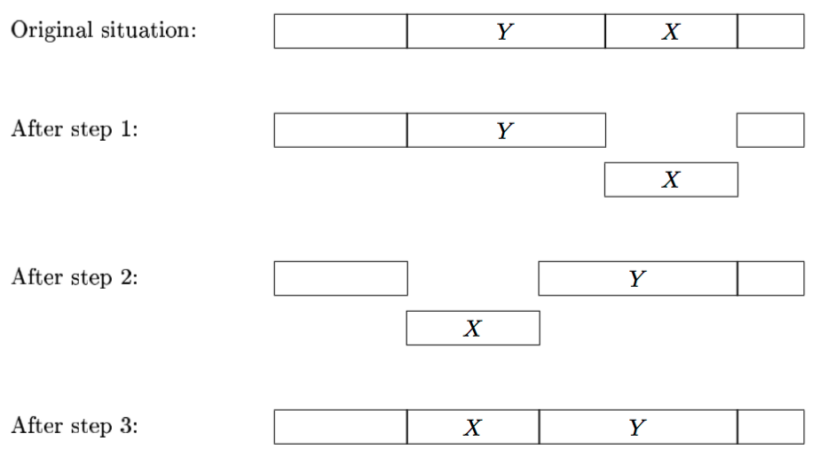

## 문제

The Leiden University Library has millions of books. When a student wants to borrow a certain book, he usually submits an online loan form. If the book is available, then the next day the student can go and get it at the loan counter. This is the modern way of borrowing books at the library.

There is one department in the library, full of bookcases, where still the old way of borrowing is in use. Students can simply walk around there, pick out the books they like and, after registration, take them home for at most three weeks.

Quite often, however, it happens that a student takes a book from the shelf, takes a closer look at it, decides that he does not want to read it, and puts it back. Unfortunately, not all students are very careful with this last step. Although each book has a unique identification code, by which the books are sorted in the bookcase, some students put back the books they have considered at the wrong place. They do put it back onto the right shelf. However, not at the right position on the shelf.

Other students use the unique identification code (which they can find in an online catalogue) to find the books they want to borrow. For them, it is important that the books are really sorted on this code. Also for the librarian, it is important that the books are sorted. It makes it much easier to check if perhaps some books are stolen: not borrowed, but yet missing.

Therefore, every week, the librarian makes a round through the department and sorts the books on every shelf. Sorting one shelf is doable, but still quite some work. The librarian has considered several algorithms for it, and decided that the easiest way for him to sort the books on a shelf, is by sorting by transpositions: as long as the books are not sorted,

1. take out a block of books (a number of books standing next to each other),
2. shift another block of books from the left or the right of the resulting ‘hole’, into this hole,
3. and put back the first block of books into the hole left open by the second block.

One such sequence of steps is called a transposition.

The following picture may clarify the steps of the algorithm, where X denotes the first block of books, and Y denotes the second block.

Of course, the librarian wants to minimize the work he has to do. That is, for every bookshelf, he wants to minimize the number of transpositions he must carry out to sort the books. In particular, he wants to know if the books on the shelf can be sorted by at most 4 transpositions. Can you tell him?

## 입력

The first line of the input file contains a single number: the number of test cases to follow. Each test case has the following format:

* One line with one integer n with 1 ≤ n ≤ 15: the number of books on a certain shelf.
* One line with the n integers 1, 2, …, n in some order, separated by single spaces: the unique identification codes of the n books in their current order on the shelf.

## 출력

For every test case in the input file, the output should contain a single line, containing:

* if the minimal number of transpositions to sort the books on their unique identification codes (in increasing order) is T ≤ 4, then this minimal number T;
* if at least 5 transpositions are needed to sort the books, then the message "5 or more".
