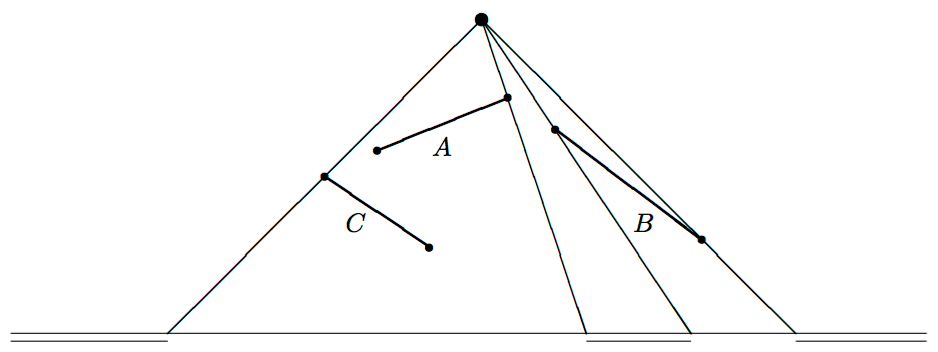

## 문제

We have a (point) light source at position (xL, yL) with yL > 0, and a finite series of line segments, all of finite non-zero length, given by the coordinates of their two endpoints. These endpoints are all different. The line segments are all situated above the x-axis (y > 0).

The segments cast their shadows onto the x-axis. We assume that the shadows of two segments either do not overlap at all, or have an overlap that has some non-zero width (they do not just touch). We also assume that for each segment its shadow is more than just one point, i.e., there is no segment that is directed toward the light source. The height of the light source (yL) is at least 1 unit larger than the y-coordinates of the endpoints of the line segments. This guarantees that indeed each line segment has a bounded shadow on the x-axis.

The collection of shadows divides the x-axis into dark and lighted areas (intervals). The problem is to determine the number of lighted areas — which is at least 2 (if there is at least one line segment, otherwise it is 1).

In the picture below the three line segments A, B and C cause three lighted areas, as indicated.

## 입력

The first line of the input file contains a single number: the number of test cases to follow. Each test case has the following format:

* One line with one integer n with 0 ≤ n ≤ 100: the number of line segments.
* One line with two integers xL and yL, the coordinates of the light source, separated by a single space. The coordinates satisfy −100 ≤ xL ≤ 100 and 1 ≤ yL ≤ 1,000.
* n lines, each containing four integers xi, yi, ui and vi, separated by single spaces, that specify x- and y-coordinates of the two endpoints (xi, yi) and (ui, vi) of the ith line segment, where −100 ≤ xi, ui ≤ 100 and 0 < yi, vi < yL, for 1 ≤ i ≤ n.

## 출력

For every test case in the input file, the output should contain a single number, on a single line: the number of lighted areas.

## 힌트

The first test case below corresponds to the picture in the problem description. The second test case has two crossing line segments.
