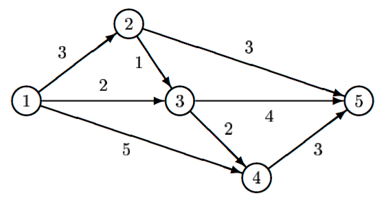

## 문제

Tour operator Your Personal Holiday organizes guided bus trips across the Benelux. Every day the bus moves from one city S to another city F. On this way, the tourists in the bus can see the sights alongside the route travelled. Moreover, the bus makes a number of stops (zero or more) at some beautiful cities, where the tourists get out to see the local sights.

Different groups of tourists may have different preferences for the sights they want to see, and thus for the route to be taken from S to F. Therefore, Your Personal Holiday wants to offer its clients a choice from many different routes. As hotels have been booked in advance, the starting city S and the final city F, though, are fixed. Two routes from S to F are considered different if there is at least one road from a city A to a city B which is part of one route, but not of the other route.

There is a restriction on the routes that the tourists may choose from. To leave enough time for the sightseeing at the stops (and to avoid using too much fuel), the bus has to take a short route from S to F. It has to be either a route with minimal distance, or a route which is one distance unit longer than the minimal distance. Indeed, by allowing routes that are one distance unit longer, the tourists may have more choice than by restricting them to exactly the minimal routes. This enhances the impression of a personal holiday.

For example, for the above road map, there are two minimal routes from S = 1 to F = 5: 1 → 2 → 5 and 1 → 3 → 5, both of length 6. There is one route that is one distance unit longer: 1 → 3 → 4 → 5, of length 7.

Now, given a (partial) road map of the Benelux and two cities S and F, tour operator Your Personal Holiday likes to know how many different routes it can offer to its clients, under the above restriction on the route length.

## 입력

The first line of the input file contains a single number: the number of test cases to follow. Each test case has the following format:

* One line with two integers N and M, separated by a single space, with 2 ≤ N ≤ 1,000 and 1 ≤ M ≤ 10, 000: the number of cities and the number of roads in the road map.
* M lines, each with three integers A, B and L, separated by single spaces, with 1 ≤ A, B ≤ N, A ≠ B and 1 ≤ L ≤ 1,000, describing a road from city A to city B with length L.

The roads are unidirectional. Hence, if there is a road from A to B, then there is not necessarily also a road from B to A. There may be different roads from a city A to a city B.

* One line with two integers S and F, separated by a single space, with 1 ≤ S, F ≤ N and S ≠ F: the starting city and the final city of the route.

There will be at least one route from S to F.

## 출력

For every test case in the input file, the output should contain a single number, on a single line: the number of routes of minimal length or one distance unit longer. Test cases are such, that this number is at most 109 = 1,000,000,000.

## 힌트

The first test case above corresponds to the picture in the problem description.
