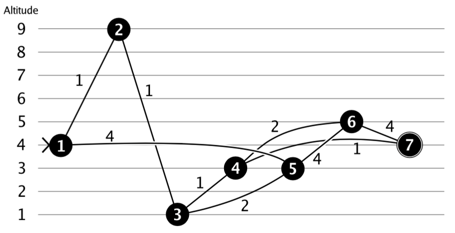

## 문제

You want to cycle to a programming contest. The shortest route to the contest might be over the tops of some mountains and through some valleys. From past experience you know that you perform badly in programming contests after experiencing large differences in altitude. Therefore you decide to take the route that minimizes the altitude difference, where the altitude difference of a route is the difference between the maximum and the minimum height on the route. Your job is to write a program that finds this route.

You are given:

* the number of crossings and their altitudes, and
* the roads by which these crossings are connected.

Your program must find the route that minimizes the altitude difference between the highest and the lowest point on the route. If there are multiple possibilities, choose the shortest one.

For example:

In this case the shortest path from 1 to 7 would be through 2, 3 and 4, but the altitude difference of that path is 8. So, you prefer to go through 5, 6 and 4 for an altitude difference of 2. (Note that going from 6 directly to 7 directly would have the same difference in altitude, but the path would be longer!)

## 입력

On the first line an integer t (1 ≤ t ≤ 100): the number of test cases. Then for each test case:

* One line with two integers n (1 ≤ n ≤ 100) and m (0 ≤ m ≤ 5000): the number of crossings and the number of roads. The crossings are numbered 1..n.
* n lines with one integer hi (0 ≤ hi ≤ 1 000 000 000): the altitude of the i-th crossing.
* m lines with three integers aj, bj (1 ≤ aj,bj ≤ n) and cj (1 ≤ cj ≤ 1000000): this indicates that there is a two-way road between crossings aj and bj of length cj. You may assume that the altitude on a road between two crossings changes linearly.

You start at crossing 1 and the contest is at crossing n. It is guaranteed that it is possible to reach the programming contest from your home.

## 출력

For each testcase, output one line with two integers separated by a single space:

* the minimum altitude difference, and
* the length of shortest path with this altitude difference.
