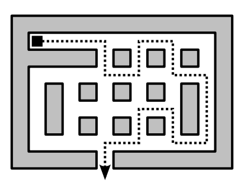

## 문제

You find yourself trapped in a large rectangular room, made up of large square tiles; some are accessible, others are blocked by obstacles or walls. With a single step, you can move from one tile to another tile if it is horizontally or vertically adjacent (i.e. you cannot move diagonally).

To shake off any people following you, you do not want to move in a straight line. In fact, you want to take a turn at every opportunity, never moving in any single direction longer than strictly necessary. This means that if, for example, you enter a tile from the south, you will turn either left or right, leaving to the west or the east. Only if both directions are blocked, will you move on straight ahead. You never turn around and go back!

Given a map of the room and your starting location, figure out how long it will take you to escape (that is: reach the edge of the room).

## 입력

On the first line an integer t (1 ≤ t ≤ 100): the number of test cases. Then for each test case:

* a line with two integers separated by a space, h and w (1 ≤ h, w ≤ 80), the height and width of the room;
* then h lines, each containing w characters, describing the room. Each character is one of . (period; an accessible space), # (a blocked space) or @ (your starting location). There will be exactly one @ character in each room description.

## 출력

For each test case:

* A line with an integer: the minimal number of steps necessary to reach the edge of the room, or -1 if no escape is possible.
