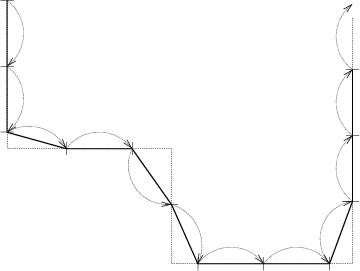

## 문제

Protože hlavní část zasedání se konala v Kongresovém Finančním Centru (KFC), bylo samozřejmě nutné zajistit tomuto místu kvalitní ochranu. Jak jste jistě sami viděli, přes den byla tato stavba hlídána více než dostatečně. Nás ale bude zajímat poněkud všednější noc, kdy i většina demonstrantů již ulehla ke spánku.

Je jasné, že i v noci je třeba budovu ohlídat. Bývá k tomu určeno několik speciálně školených strážných, kteří obchází KFC celou noc po různých trasách. Nejdůležitější z nich vede po úzké zídce kolem celé budovy. Tato trasa byla vytyčena ze strategických důvodů, neboť z ní je velmi dobrý výhled do celého okolí. A aby bylo celé okolí pokryto, musí být na tuto trasu nasazeno strážných několik. Ale protože lidí na práci je vždy méně, než by bylo třeba, vedení Policie potřebuje určit minimální počet strážných tak, aby stále měli celé okolí budovy v dohledu. K řešení tohoto problému je však třeba znát, jak je trasa dlouhá a za jak dlouho ji strážný projde. A to právě bude vaším úkolem.

Pro určení délky trasy se u Policie používá měření tzv. *policejních normokroků* (zkratka*ponork*). Zídka má podobu rovných úseků, které na sebe navazují v pravém úhlu. Každý úsek má délku nejméně jeden ponork. Pro účely měření je v policejních předpisech stanoveno, že strážný jdoucí po zídce nezkracuje při změně směru krok, ale překračuje rohy tak, že délka jeho kroku je stále přesně jeden ponork. Šířku zídky považujeme za nulovou. Pokud se celá trasa nedá projít tak, že posledním krokem strážný skončí přesně v koncovém bodě zídky, počítá se zbytek jako celý krok pouze v případě, že je dlouhý nejméně půl ponorku. Vaším úkolem je určit délku trasy, která vede po zídce, v ponorcích. (Ilustrační obrázek odpovídá prvnímu z příkladů vstupu.)

## 입력

První řádek vstupního souboru obsahuje celé kladné číslo Z, za kterým následuje postupně Zzadání. Každé zadání začíná řádkem obsahujícím dvě hodnoty: K a U, (1 <= K<1000, 1 <=U<5000) kde K je délka kroku strážného (velikost ponorku) a U je počet úseků zídky. Po nich následuje U čísel určujících délky jednotlivých úseků, každé číslo je na samostatném řádku.

## 출력

Pro každé zadání vypíše program právě jeden řádek s textem "`Strazny ujde X ponorku.`" kde X je počet ponorků potřebných k projití celé zídky.
