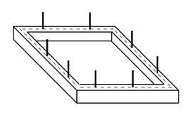
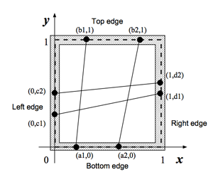
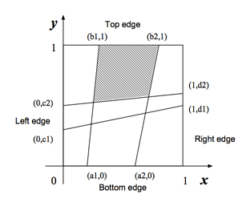

## 문제

A fisherman named Etadokah awoke in a very small island. He could see calm, beautiful and blue sea around the island. The previous night he had encountered a terrible storm and had reached this uninhabited island. Some wrecks of his ship were spread around him. He found a square wood-frame and a long thread among the wrecks. He had to survive in this island until someone came and saved him.

In order to catch fish, he began to make a kind of fishnet by cutting the long thread into short threads and fixing them at pegs on the square wood-frame (Figure 1). He wanted to know the sizes of the meshes of the fishnet to see whether he could catch small fish as well as large ones.

The wood-frame is perfectly square with four thin edges one meter long: a bottom edge, a top edge, a left edge, and a right edge. There are n pegs on each edge, and thus there are 4n pegs in total. The positions of pegs are represented by their (x, y)-coordinates. Those of an example case with n = 2 are depicted in Figures 2 and 3. The position of the ith peg on the bottom edge is represented by (ai, 0). That on the top edge, on the left edge and on the right edge are represented by (bi, 1), (0, ci), and (1, di), respectively. The long thread is cut into 2n threads with appropriate lengths. The threads are strained between (ai, 0) and (bi, 1), and between (0, ci) and (1, di) (i = 1,...,n).

You should write a program that reports the size of the largest mesh among the (n + 1)2 meshes of the fishnet made by fixing the threads at the pegs. You may assume that the thread he found is long enough to make the fishnet and that the wood-frame is thin enough for neglecting its thickness.



Figure 1. A wood-frame with 8 pegs.



Figure 2. Positions of pegs (indicated by small black circles)



Figure 3. A fishnet and the largest mesh (shaded)

## 입력

The input consists of multiple subproblems followed by a line containing a zero that indicates the end of input. Each subproblem is given in the following format.

```

n
a1 a2 ... an
b1 b2 ... bn
c1 c2 ... cn
d1 d2 ... dn
```

An integer n followed by a newline is the number of pegs on each edge. a1, ... , an, b1, ... , bn, c1, ... , cn, d1, ... , dn are decimal fractions, and they are separated by a space character except that an, bn, cn and dn are followed by a newline. Each ai (i = 1,...,n) indicates the x-coordinate of the ith peg on the bottom edge. Each bi (i = 1,...,n) indicates the x-coordinate of the ith peg on the top edge. Each ci (i = 1,...,n) indicates the y-coordinate of the ith peg on the left edge. Each di (i = 1,...,n) indicates the y-coordinate of the ith peg on the right edge. The decimal fractions are represented by 7 digits after the decimal point. In addition you may assume that 0 < n < 30, 0 < a1 < a2 < ... < an < 1, 0 < b1 < b2 < ... < bn < 1, 0 < c1 < c2 < ... < cn < 1 and 0 < d1 < d2 < ... < dn < 1.

## 출력

For each subproblem, the size of the largest mesh should be printed followed by a newline. Each value should be represented by 6 digits after the decimal point, and it may not have an error greater than 0.000001.
