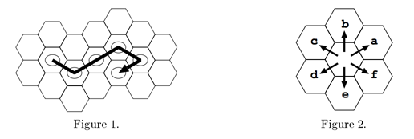
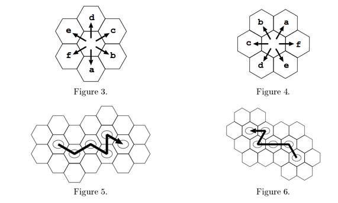

## 문제

Taro and Hanako, students majoring in biology, have been engaged long in observations of beehives. Their interest is in finding any egg patterns laid by queen bees of a specific wild species. A queen bee is said to lay a batch of eggs in a short time. Taro and Hanako have never seen queen bees laying eggs. Thus, every time they find beehives, they find eggs just laid in hive cells.

Taro and Hanako have a convention to record an egg layout: they assume the queen bee lays eggs, moving from one cell to an adjacent cell along a path containing no cycles. They record the path of cells with eggs. There is no guarantee in biology for them to find an acyclic path in every case. Yet they have never failed to do so in their observations.

There are only six possible movements from a cell to an adjacent one, and they agree to write down those six by letters a, b, c, d, e, and f counterclockwise as shown in Figure 2. Thus the layout in Figure 1 may be written down as "faafd".

Taro and Hanako have investigated beehives in a forest independently. Each has his/her own way to approach beehives, protecting oneself from possible bee attacks.

They are asked to report on their work jointly at a conference, and share their own observation records to draft a joint report. At this point they find a serious fault in their convention. They have never discussed which direction, in an absolute sense, should be taken as "a", and thus Figure 2 might be taken as, e.g., Figure 3 or Figure 4. The layout shown in Figure 1 may be recorded differently, depending on the direction looking at the beehive and the path assumed: "bcbdb" with combination of Figure 3 and Figure 5, or "bccac" with combination of Figure 4 and Figure 6.

A beehive can be observed only from its front side and never from its back, so a layout cannot be confused with its mirror image.

Since they may have observed the same layout independently, they have to find duplicated records in their observations (Of course, they do not record the exact place and the exact time of each observation). Your mission is to help Taro and Hanako by writing a program that checks whether two observation records are made from the same layout.

## 입력

The input starts with a line containing the number of record pairs that follow. The number is given with at most three digits.

Each record pair consists of two lines of layout records and a line containing a hyphen. Each layout record consists of a sequence of letters a, b, c, d, e, and f. Note that a layout record may be an empty sequence if a queen bee laid only one egg by some reason. You can trust Taro and Hanako in that any of the paths in the input does not force you to visit any cell more than once. Any of lines in the input contain no characters other than those described above, and contain at most one hundred characters.

## 출력

For each pair of records, produce a line containing either "true" or "false": "true" if the two records represent the same layout, and "false" otherwise. A line should not contain any other characters.
