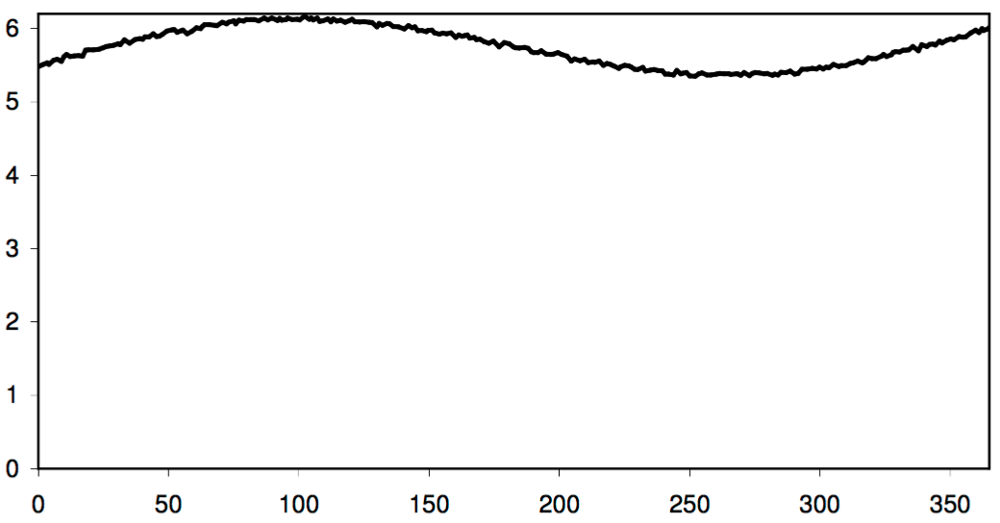

## 문제

The brave knights (kə’ nig’ əts) of Camelot are constantly exposed to French taunting while assaulting the castle occupied by the French. Consequently, the taunting to which they are exposed varies with their distance from the castle during their assault, as well as variations in French taunting activity. We need to estimate the total amount of taunting that they are exposed to during a certain time period. Unfortunately, we only have access to a set of measurements at random times — we do not have a continuous reading — and, because of flaws in our archaic equipment, the measurements of taunting occur at unpredictable intervals.

The total amount of taunting will be given by the integral of the taunting intensity during the time period, as held in the observation data file. The amount of random noise, though, is fairly high, so that a simple trapezoid-rule integration is all that is merited.

<Fig> Taunt Exposure Estimation  

## 입력

* A single number, n, specifying the number of data points in the file
* n pairs of floating point numbers (given in increasing x order), separated by a comma — in other words, a CSV file that could be input for a spreadsheet program [the first number is the x coordinate (time specification), the second is the y coordinate (the radiation reading)]

## 출력

A single line of text giving the first and last x values (with two digits to the right of the decimal point), and the computed integral (with four digits to the right of the decimal point), in the fashion shown below (which reflects the data shown in the graph):

0.00 to 365.25: 2099.8021

[A reasonable value for the given input, (shown in the graph above), since the values range around 5 3⁄4, and 365.25 \* 5.75 gives 2100.1875.]
