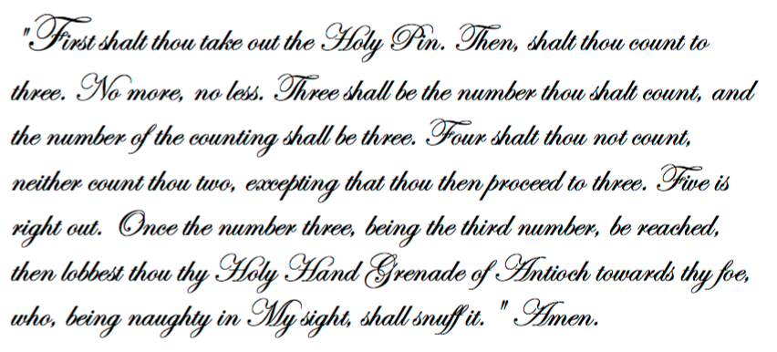
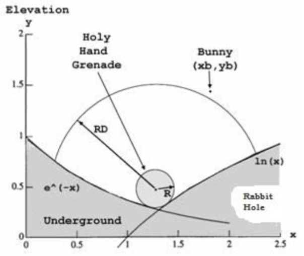

## 문제

Holy Hand Grenades have found multiple uses throughout history. Most notably, King Arthur did use a Holy Hand Grenade (HHG) to dispatch a vicious rabbit which was guarding the entrance to a cave. The instructions for its use are in the Book of Armaments (Chapter 2, verses 9-21), and are read as follows:

Unfortunately, the Book of Armaments faileth to mention that the HHG must come to a complete stop (i.e. rest stably) before it can explodeth and blow a rabbit to tiny bits. As long as it rolleth or wobbeleth, it refuseth to explodeth. Unknown is the reason why the authors of the Book of Armaments neglected to mention this pertinent fact. Further complicating matters, different HHGs have different radii of destruction (RD). Once a HHG resteth stably, and explodeth, everything within or equal to its RD shalt be snuffed out. Presumably, this is what happened to the rabbit with big, pointy teeth; however, there remaineth some controversy over this matter. Because of this controversy, the king hath decreed a simulation to be run that may possibly answer this question.

* Your task is to determine the result of the grenade’s explosion.
* The grenade must always be at rest in order to detonate. All HHGs have a radius R=1 and a variable radius of destruction (RD). At the instant of detonation, the rabbit could be mid-leap, on the ground, or underground.
* For each simulation the terrain remaineth unchanged. It consisteth of two intersecting curves, y = e -x and y = ln(x) as we have revealed unto you in the illustrious illustration. The curves reside in the plane formed by the rabbit, the grenade, and the center of the earth. The terrain is impervious to detonations, and changeth not between tests.
* If a bunny’s center of mass is strictly below the ground level (as denoted by the intersecting curves) when a HHG explodeth, that bunny shalt remaineth un-snuffedeth and thus shalt live to bite another day.
* If the bunny resideth strictly outside of the range of a stably resting HHG’s radius of destruction, that bunny shalt also remain un-snuffedeth out.
* Each result shalt be dependent upon computations accurate even unto 8 significant figures.
* There shalt not be an input value smaller even than 1.0E-15 or greater even than 1.0E+15.
* Because the bunny’s center of mass doth be its location, a bunny might possibly end up inside both the RD and the R=1 of a HHG. This simply means the bunny is curled around the grenade. If the center of mass of such a bunny be strictly inside the RD it shall most surely be snufféd out. Amen.

## 입력

The first line of input doth contain yea verily a single integer indicating the number of holy hand grenades in the data file. Each line of the file doth contain the radius of destruction of this particular holy hand grenade, and finally doth contain the rabbit’s x coordinate (xb) and y coordinate (yb) during this particular test run.

## 출력

For each test run, thy program shalt print out the words “Bunny Bits” (if the rabbit is blown to bits by the grenade) or “Bunny Biteth Knights” (if the rabbit liveth to fight on another day anon).
