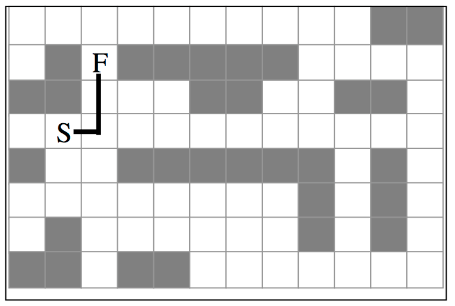
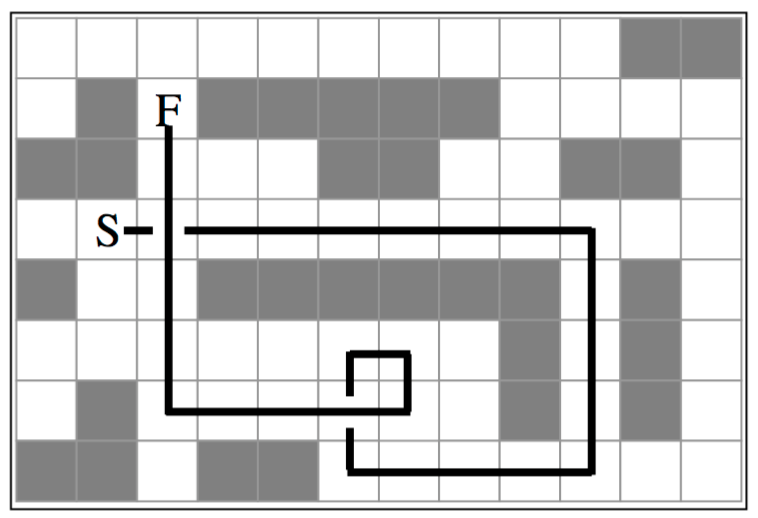

## 문제

* ALL HEADS: You're a Knight of the Round Table?
* ROBIN: I am.
* LEFT HEAD: In that case I shall have to kill you.
* MIDDLE HEAD: Shall I?
* RIGHT HEAD: Oh, I don't think so.
* MIDDLE HEAD: Well, what do I think?
* LEFT HEAD: I think kill him.
* RIGHT HEAD: Well let's be nice to him.
* MIDDLE HEAD: Oh shut up.

As the story goes, the Knight scarpers off. Right Head has taken it upon himself to search the grounds for the knight so he, Left, and Middle can go extinguish him (and then have tea and biscuits.)

Consider the following 8 by 12 maze, where shaded squares are walls that can’t be entered.



The shortest path between the Right Head (denoted by the S, for start) and the knight (denoted by the F, for finish) is of length 3, as illustrated above. But! Right Head can’t turn left or make U- Turns. He can only move forward and turn right. That means the shortest path that Right Head can find is significantly longer: at 29!



## 입력

The input file will consist of a single integer N (N > 0) specifying the number of mazes in the file. Following this, on a maze by maze basis will be the number of rows, r (3 < r ≤ 20), a space, then the number of columns, c (3 < c ≤ 20). After this will follow r lines of c characters, representing a map of the maze:

```

XXXXXXXXXXXXXX 
X          XXX
X XFXXXXX    X 
XXX   XX  XX X 
X S          X 
XX  XXXXXX X X 
X        X X X 
X X      X X X 
XXX XX       X 
XXXXXXXXXXXXXX
```

X’s mark those locations that are walls and can’t be occupied. S marks the start location, and F marks the Knight. Blanks are locations that can be freely traveled.

## 출력

The output is the length of the shortest path between the start and finish locations. Based on the above maze, your program would output the minimum no-left-turns path length of 29.

## 힌트

Additional Constraints/Information:

* Right Head is capable of moving from the start position in any of the four primary compass directions. After that, he’s constrained to either step forward or right.
* The start and end locations will never be the same.
* The maze is always surrounded by four walls.
* You can assume that a path between the start and final locations always exists.
