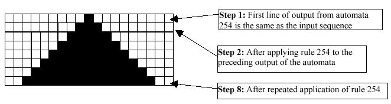
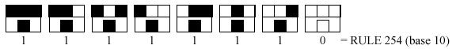
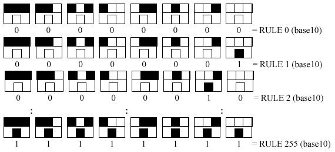

## 문제

Stephen Wolfram in a “New Kind of Science” describes a special kind of cellular automata. The automata he describes are rather interesting. They consist of rows of blocks, where blocks are either filled or not filled depending on the previous row. To generate a new row of blocks, the automata looks at the preceding row and then follows a pre-set “rule” to either color or not color a square on the output row.

For example the following diagram illustrates the “output” from one of these special kind of cellular automata:

was generated by repeated application of “Rule 254”. The automaton was initialized with an input line that consisted of a single black square. Repeated application of rule 254 to the ouput line from the preceding step generated the black triangle shown above.

For this rule, the top row in each box gives one of eight possible color combinations for a cell (the middle cell) and its two neighbors (the left and right neighbors of the cell). The bottom row in a box specifies the color that the center cell should have on the next step for each of the 8 possible cases.

Given this arrangement, there are 255 different generating rules or automata numbered as follows:

### The “Bounded” Automata

* Unlike the automata in “A New Kind of Science”, the automata for this problem operate in a “bounded space”. In other words, each line output by an automaton consists of exactly n squares, and, the first square, and the last square of the output from a bounded automaton are always white no matter what the rule for the automata. This means that while an automaton can examine the first and last square of its input line when computing the new second and second to last characters, it cannot change the first or last square when it outputs a line. Thus, the first and the last square on a line must always remain white.
* Bounded automata will always start life on a line with an odd number of squares, and all of the squares (except the middle square) are white. The middle square for step 1 is always black.
* The number of squares is determined by the string for which the program is searching (the second field of an input line)

### The Program

For every line in the input file, your program must determine which (if any) of the 255 possible automata could have generated that particular line when started from the standard starting state. If none of the automata generate the sequence by the given step number, output “NONE”. If more than one automata generated that line, then, you must output all of the automata that generate the line as described below in the output section.

## 입력

* The first field on a line of input consists of a maximum step number (max\_step) for the automata to run. This number can be up to 32 bits. Values are chosen such that the problem is solvable within the given time limits given the input specifications.
* The second field on a line of input consists of an odd-length string of characters which represent the “squares” on the line. These will not be longer than 256 characters in length, and can be shorter. The size of the second field determines n -- the number of squares in a particular automata.
* The character ‘W’ represents a white square and a ‘B’ represents a black square.
* If an input string contains characters other than ‘W’ or ‘B’, or if the input string is an invalid string (not a properly bounded string as described previously), then obviously the string cannot be found by any of the automata, and the output will be LINE # NONE as illustrated in the sample output.
* Each line in the input file will have a terminating newline character.
* Input is terminated by a single line with the characters “END OF INPUT” as illustrated below. The END OF INPUT line should not be processed by your search algorithm.

## 출력

* The output consists of LINE # followed by pairs of numbers (rule, step) where rule is the rule number of the automata (0 through 255) that generated a particular output and step is the first step in the sequence of outputs (1, 2,…, max\_step) at which the automata generated the desired output sequence.
* If more than one rule generated the desired output sequence on or before the maximum step number, list a pair for each rule number that generated the desired output, in order, from lowest automata number to highest automata number with a space between each output pair.
* If none of the automata generate the particular line from the input file before or on the maximum step number, output LINE # NONE (where # represents the number of the input line with the search string).
