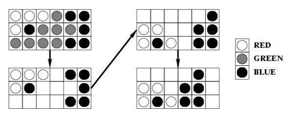

## 문제

The game named "Same" is a single-person game played on a 10 by 15 board. Each square contains a ball colored red (R), green (G), or blue (B). Two balls belong to the same cluster if they have the same color, and one can be reached from another by following balls of the same color in the four directions up, down, left, and right. At each step of the game, the player chooses a ball whose cluster has at least two balls and removes all balls in the cluster from the board. Then, the board is "compressed" in two steps:

1. Shift the remaining balls in each column down to fill the empty spaces. The order of the balls in each column is preserved.
2. If a column becomes empty, shift the remaining columns to the left as far as possible. The order of the columns is preserved.

For example, choosing the ball at the bottom left corner in the sub-board causes:

The objective of the game is to remove all balls from the board, and the game is over when all balls are removed or when all clusters have only one ball.

The scoring of each game is as follows. The player starts with a score of 0. When a cluster of size m is removed, the player's score increases by (m-2)^2. A bonus of 1000 is given if all balls are removed at the end of the game.

You suspect that a good strategy may be to choose the ball that gives the largest possible cluster at each step, and you want to test this strategy by writing a program to simulate games played using this strategy. If there are two or more balls to choose from, the program chooses the leftmost ball giving the largest cluster. If there is still a tie, choose the bottommost ball of these leftmost balls.

## 입력

You will be given a number of games in the input. The first line of input contains a positive integer giving the number of games to follow. The initial arrangement of the balls of each game is given one row at a time, from top to bottom. Each row contains 15 characters, each of which is one of "R", "G", or "B", specifying the colors of the balls in the row from left to right. A blank line precedes each game.

## 출력

For each game, print the game number, followed by a new line, followed by information about each move, followed by the final score. Each move should be printed in the format:

Move x at (r,c): removed b balls of color C, got s points.

where:

* x is the move number.
* (r,c) are the row number and column number of the chosen ball, respectively. The rows are numbered from 1 to 10 from the bottom, and columns are numbered from 1 to 15 from the left.
* b is the number of balls in the cluster removed.
* C is one of "R", "G", or "B", indicating the color of the balls removed.
* s is the score for this move. The score does not include the 1000 bonus if the move removes all balls.

The final score should be reported as follows:

Final score: s, with b balls remaining.

Note: use the plural form of "ball" and "point" even if it is 1.
