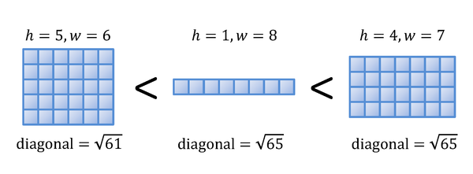

## 문제

높이 h와 너비 w가 자연수인 직사각형을 정수 직사각형이라고 한다. 넓은 정수 직사각형은 w가 h보다 큰 (w>h)인 정수 직사각형이라고 한다.

넓은 정수 직사각형의 순서는 다음과 같이 정할 수 있다. 두 직사각형이 있을 때,

1. 대각선의 길이가 짧은 쪽이 작다.
2. 대각선의 길이가 같은 경우에는 높이가 작은 것이 작다.

넓은 정수 직사각형이 주어졌을 때, 그 직사각형보다 큰 직사각형 중 가장 작은 것을 찾는 프로그램을 작성하시오.

## 입력

입력은 여러 개의 테스트 케이스로 이루어져 있다. 테스트 케이스의 개수는 100개를 넘지 않는다. 각 테스트 케이스는 넓은 정수 직사각형의 높이와 너비 h, w이 공백으로 구분되어서 주어진다.

h와 w(>h)는 0보다 크며, 100을 넘지 않는다.

입력의 마지막 줄에는 0이 두 개 주어진다.

## 출력

각 테스트 케이스에 대해서, 입력으로 주어진 넓은 정수 직사각형보다 큰 직사각형 중 가장 작은 넓은 정수 직사각형의 높이와 너비를 출력한다. 이 값은 150을 넘지 않는다.
