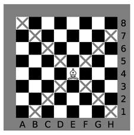

## 문제

체스에서 비숍은 대각선으로만 움직일 수 있는 말이다. 비숍은 현재 있는 칸과 같은 색상을 가지는 칸은 몇 번 움직이면 이동할 수 있다. (체스판에 다른 말은 없다고 가정한다)

체스판 위의 두 좌표가 주어진다. 이때, 비숍이 한 좌표에서 다른 좌표로 이동할 수 있는지와 그 방법을 구하는 프로그램을 작성하시오. 체스판의 좌표는 글자(A-H)와 숫자(1-8)로 나타내며, 글자는 열에, 숫자는 행에 적혀져 있다.

**그림 1** – 체스판, 비숍, 비숍이 한 번에 움직일 수 있는 위치

## 입력

첫째 줄에 테스트 케이스의 개수 T가 주어진다. 각 테스트 케이스는 한 줄로 이루어져 있고, 시작 위치 X와 도착 위치 Y가 주어진다. 각 위치는 두 글자가 공백으로 구분되어져 있다. 글자는 열, 숫자는 행이다. 중복되는 테스트 케이스는 주어지지 않는다.

## 출력

각 테스트 케이스에 대해서 한 줄을 출력한다. 만약, 비숍이 X에서 Y로 이동할 수 없으면 'Impossible'을 출력한다. 이 경우를 제외하면, 움직이는 방법을 출력한다.

움직일 수 있을 때는 먼저 움직인 횟수를 출력한다. 그 다음에는 입력 형식과 같은 형식으로 움직인 방법을 출력한다. 최대 4번 움직일 수 있으며, 가능한 경우가 여러 개일 때에는 아무거나 출력하면 된다.
