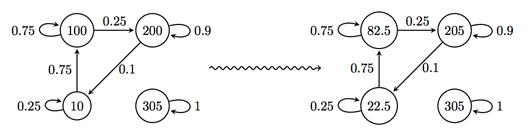
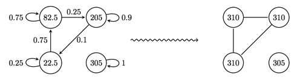

## 문제

은하계의 충돌이 다가오고 있다.

미스테리한 MdI가 다스리는 은하계는 지금 우리 은하를 무력으로 합병하려고 하고 있다. 하지만 은하계 정부는 상황을 반전시킬 계획을 가지고 있다.

우리 정보국은 적의 본부에 잠입했고, 놀라운 지능을 얻게되었다. 적은 정해진 계획에 의해서 병력을 움직인다. 그 계획은 각 요새에 주둔하고 있는 병력의 일정 비율이 다른 요새로 매 시간마다 이동하는 것이다. (요새 사이를 이동하는 시간은 무시할 수 있다)

자 이제 정부는 공격할 날짜를 정했다. 이제 적의 약점을 찾아야 한다. 하지만, 적의 은하는 매우 멀기 때문에 그 곳으로 날아가는데 1시간이 걸린다. 게다가 우리는 MdI가 우리의 목표를 알아채고 우리의 공격지점으로 갈 수 있는 모든 병력의 이동을 즉시 시작할 것을 알고 있다. (이 경우에는 방향에 상관 없이 이동 가능) 스파이는 당신에게 힘의 통계값을 알려 주었다.

## 입력

첫째 줄에 테스트 케이스의 개수 1 ≤ T ≤ 10가 주어진다. 각 테스트 케이스의 첫째 줄에는 적의 요새의 수 N (1 ≤ N ≤ 100)과 연결된 링크의 수 l (0 ≤ l ≤ (N - 1)2), 그리고 공격할 시간 t (0 ≤ t ≤ 5000)가 주어진다. 둘째 줄에는 N개의 double값 ui 가 주어진다. (0 ≤ ui ≤ 1000) ui는 각 요새에 있는 부대의 힘의 통계값이다. 다음 l개 줄에는 링크의 정보가 포함되어 있다. 각 링크의 정보의 첫 두 정수 sj (0 ≤ sj < N)와 tj (0 ≤ tj < N)는 링크의 출발장소와 도착장소이고, 다음에 주어지는 pj (0 < pj ≤ 1)는 sj에서 tj로 이동하는 병력의 비율이다.

## 출력

적의 은하에서 가장 약한 지점 (모일 수 있는 부대의 힘의 통계값이 가장 작은 곳)의 힘의 통계값을 출력한다. 소수점 오차는 10-6까지 허용한다.

## 힌트

**그림 3** – 첫 번째 예제의 힘의 통계값 (왼쪽: 처음, 오른쪽: 1시간이 지난 후)

**그림 4** – 공격을 시작한 시점에서 각 요새의 힘의 통계값 (이때, 링크는 양방향이 된다)
