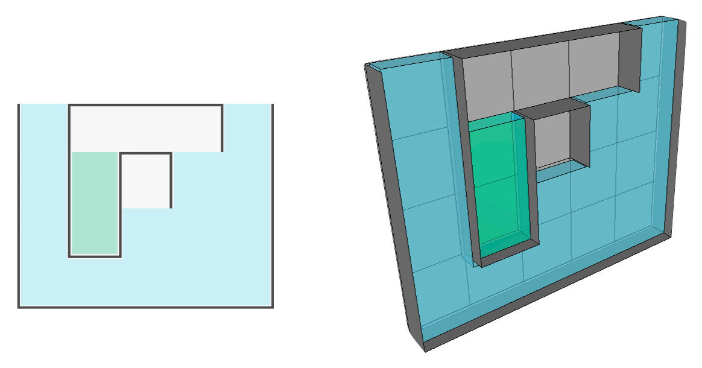

## 문제

Consider a thin rectangular tank with baffles that block the flow of water. The tank can be filled from one or more holes in its top, but the baffles prevent the water from reaching various parts, so that the tank may end up containing trapped pockets of air.

For example, the diagram below suggests a possible tank in profile and in perspective (with the front removed so you can see what's inside). The tank is "full", but the configuration of the baffles leaves two pockets of air. Note that because of the syphon effect, water will flow into the green "well" along the intervening baffle, even though the air pocket above will remain empty.



The tank dimensions and the positions of the baffles fall on a regular grid. For example, the tank above is 5 units wide, 4 units high, and 1 unit in thickness, for a total volume of 20 cubic units. However, the trapped pockets of air occupy 4 cubic units, so the amount of water that the tank can hold is only 16 cubic units. (For the purposes of this problem, you can assume that the baffles do not occupy any volume, and that air is incompressible.)

Your task is to write a program that can compute the amount of water that can be poured into a given tank before it becomes "full".

## 입력

Input will consist of specifications for a series of tanks. Information for each tank begins with a line containing two integers, separated by a single space, that specify the tank's width (1 <= w < 100) and height (1 <= h <= 1000). (All tanks have an implied thickness of 1.) A line containing 0 0 terminates the input.

The following lines contain strings that specify the location of baffles. For a tank of width w and height h, there will be exactly h+1 lines, each containing exactly 2\*w+1 characters. Each line specifies the baffles around the cells in one "row" of the tank. The first character represents the left-hand wall of the tank and is always '|' (except for first line, which  represents the "lid" row of cells above the real tank). The remaining characters in each line, taken in pairs, represent the cells on that line. If a cell has a baffle below it, the first character in the pair is '\_'; if it is open below, the character is '.'. Similarly, if a cell has a baffle to its right, the second character in each pair is '|'; otherwise it is '.'.

The choice of characters is such that the lines create a simple ASCII picture of the tank profile. For example, the tank above would be specified as follows:

```

5 4
..._._._...
|.|.._..|.|
|.|.|.|...|
|.|_|.....|
|_._._._._|
```

## 출력

Output should consist of one line for each tank comprising the tank number (formatted as shown) following by a single space and the volume of water the tank can hold.
