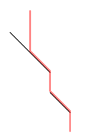

## 문제

선영이는 핀볼 중독자이다. 선영이는 항상 자신이 원하는 위치에 공을 맞출 수 있다. 하지만, 공이 범퍼에 많이 튕기기 때문에, 어디로 떨어질지는 정확하게 예측하지 못한다.

결국 선영이는 핀볼 테이블을 선분으로, 공을 높이가 무한대인 곳에서 떨어지는 점으로 모델링했다. 공은 선분을 만나기 전까지 수직으로 떨어지며, 선분을 만난 이후에는 선분의 아랫방향으로 공이 흘러간다.

선분의 끝점도 선분에 포함된다. 선분은 서로 교차하지 않으며, 선분의 끝점 또한 교차하지 않는다. 선분은 수직선이나 수평선이 아니다. 또, 입력으로 주어지는 순서에는 아무 의미가 없다.

## 입력

첫째 줄에 선분의 개수 N이 주어진다. (0 ≤ N ≤ 100,000) 다음 N개 줄에는 선분의 양 끝점 좌표 x1 y1 x2 y2가 주어진다. (-1,000,000 ≤ xi, yi ≤ 1,000,000) 마지막 줄에는 공의 맨 처음 x좌표 x0이 주어진다. (-1,000,000 ≤ x0 ≤ 1,000,000) 모든 좌표는 정수이다.

## 출력

첫째 줄에 공의 최종 위치 x좌표를 출력한다.

## 힌트

