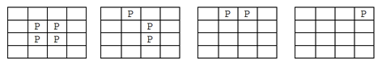

## 문제

Red John has a chess table of infinite dimensions, and n \* n pawns, arranged in an n x n square. The pawns can be moved horizontally or vertically, buy jumping over an (horizontally or vertically) adjacent pawn, and onto the next position, only if this position is unoccupied by another pawn. Also, when a valid move occurs, the jumped pawn is removed. Can you help Red John figure out if there is a sequence of moves which leaves only one pawn on the table ?

Below, such a sequence of moves is illustrated, for n = 2. Pawns are depicted by the letter P.

## 입력

The program input is from a text file. Each file contains a value for n, with 0 < n < 109.

## 출력

The output consists of 1 if there is a sequence of moves leaving only one pawn on the table, and 0 otherwise. There cannot be any whitespace and newline characters in the output. Two examples of input/output pairs are shown below.
