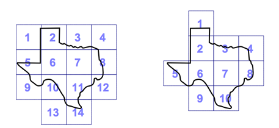

## 문제

상근이의 농장은 매우 넓기 때문에, 어떤 곳에 어떤 식물을 심었는지를 기록해 놔야 한다. 상근이는 기록을 위해 인터넷 쇼핑몰에서 고화질 지도를 주문했다. 지도는 매우 크기 때문에, 종이 한 장이 인쇄할 수 없다. 따라서, 지도를 쪼개 종이 여러 장에 인쇄를 해야 한다.

동일한 지도를 어떻게 놓느냐에 따라 필요한 종이의 개수가 달라질 수도 있다. 상근이의 정원의 지도와 종이의 크기가 주어졌을 때, 지도를 인쇄하는데 필요한 종이 개수의 최솟값을 구하는 프로그램을 작성하시오.

위의 그림은 텍사스처럼 생긴 지도를 인쇄하는 두 가지 방법이다. 첫 번째 그림은 종이 14개로 인쇄하는 방법이고, 오른쪽은 같은 지도를 동일한 종이 10개로 인쇄하는 방법이다.

종이의 변은 모두 x축과 y축에 평행해야 한다. 또, 종이는 회전시킬 수 없고, 두 종이가 전체 변을 공유하는 경우에만 접할 수 있다.

## 입력

입력은 여러 개의 테스트 케이스로 이루어져 있다. 각 테스트 케이스의 첫째 줄에는 Ar, Ac, Tr, Tc가 주어진다. Ar과 Ac는 지도의 픽셀 개수이고, Tr과 Tc는 종이 한 장에 인쇄할 수 있는 픽셀의 개수이다. (1 ≤ Ax ≤ 1000, 1 ≤ Tx ≤ 100) 다음 Ar개 줄에는 Ac개의 문자가 주어진다. 'X'는 상근이의 농장, '.'는 상근이의 농장이 아닌 곳이다.

모든 X를 종이에 인쇄해야 하며, 지도의 'X'는 모두 같은 영역에 속한다.

## 출력

각 테스트 케이스마다, 모든 'X'를 종이에 인쇄하는데 필요한 종이 개수의 최솟값을 출력한다.
