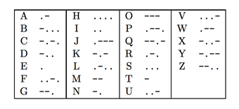
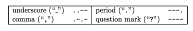

## 문제

Freddy discovered a new procedure to grow much bigger cauliflowers. He wants to share this finding with his fellow gardener Tommy but he does not want anyone to steal the procedure. So the two gardeners agreed upon using a simple encryption technique proposed by M. E. Ohaver.

The encryption is based on the Morse code, which represents characters as variable-length sequences of dots and dashes. The following table shows the Morse code sequences for all letters:

Note that four possible dot-dash combinations are unassigned. For the purposes of this problem we will assign them as follows (note these are not the assignments for actual Morse code):

In practice, characters in a message are delimited by short pauses, typically displayed as spaces.  
Thus, the message ACM GREATER NY REGION is encoded as:

.- -.-. -- ..-- --. .-. . .- - . .-. ..-- -. -.-- ..-- .-. . --. .. --- -.

The Ohaver’s encryption scheme is based on mutilating Morse code, namely by removing the pauses between letters. Since the pauses are necessary (because Morse is a variable-length encoding that is not prefix-free), a string is added that identifies the number of dots and dashes in each character. For example, consider the message “.--.-.--”. Without knowing where the pauses should be, this could be “ACM”, “ANK”, or several other possibilities. If we add length information, such as “.--.-.-- 242”, then the code is unambiguous.

Ohaver’s scheme has three steps, the same for encryption and decryption:

1. Convert the text to Morse code without pauses but with a string of numbers to indicate code lengths.
2. Reverse the string of numbers.
3. Convert the dots and dashes back into the text using the reversed string of numbers as code lengths.

As an example, consider the encrypted message “AKADTOF IBOETATUK IJN”. Converting to Morse code with a length string yields:

.--.-.--..----..-...--..-...---.-.--..--.-..--...----. 232313442431121334242

By reversing the numbers and decoding, we get the original message “ACM GREATER NY REGION”.

The security of this encoding scheme is not too high but Freddy believes it is sufficient for his purposes. Will you help Freddy to implement this encoding algorithm and to protect his sensitive information?

## 입력

The input will consist of several messages encoded with Ohaver’s algorithm, each of them on one line. Each message will use only the twenty-six capital letters, underscores, commas, periods, and question marks. Messages will not exceed 1000 characters in length.

## 출력

For each message in the input, output the decoded message on one line.
