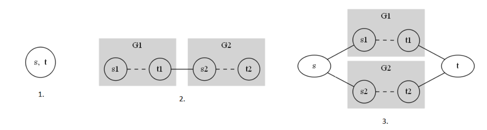
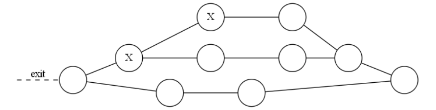

## 문제

The Adriatic coast and islands are lined with amazing beaches of all shapes and sizes. However, many beaches are not accessible by car. To accommodate the growing demand, a giant field near the coast has been converted into a parking lot. Since all of the architects involved have electrical engineering backgrounds, the layout of the parking lot resembles a series-parallel graph often used when designing electrical circuits.

The parking lot consists of parking spaces and two-way roads connecting them. Each road connects two different parking spaces and each pair of parking spaces is connected by at most one road. At any moment, each parking space can be occupied by at most one car. No other cars can travel through an occupied parking space.

Figure 1: Rules for building splots, each described in the corresponding item below

A series-parallel parking lot (also called splot) is a parking lot with two distinguished parking spaces called source and terminal that is constructed from individual parking spaces using the rules of serial and parallel composition. Each splot can be specified by its encoding – a sequence of characters describing its structure and the locations of parked cars. The valid splots and their encoding are defined recursively as follows:

* A parking lot consisting of a single parking space and no roads is a valid splot. This single parking space is both the source and the terminal of the splot. The encoding of this splot is simply the lowercase letter "o" if the parking space is empty and the lowercase letter "x" if the parking space is occupied by a car.
* If G1 and G2 are two valid splots, their serial composition G is also a splot. The serial composition is obtained by adding a road between the terminal of G1 and the source of G2. The source of the newly obtained splot G is the source of G1 while the terminal of G is the terminal of G2. If E1 and E2 are encodings of splots G1 and G2 respectively then the encoding of G is "SE1E2#". In other words, the encoding is obtained by concatenating the uppercase letter "S", the encodings of splots being composed and the hash character "#".
* If G1 and G2 are two valid splots, their parallel composition G is also a valid splot. The parallel composition is obtained by adding two new parking spaces called s and t, adding the roads between s and the sources of both G1 and G2, as well as roads between t and the terminals of both G1 and G2. The source of the newly obtained splot G is the newly added parking space s while the terminal of G is the newly added parking space t. If E1 and E2 are encodings of splots G1 and G2 respectively and Es and Et are encodings of the source s and terminal t (lowercase letter "o" if the corresponding space is empty and lowercase letter "x" otherwise) then the encoding of G is "PEs|E1E2|Et#". In other words, the encoding is obtained by concatenating the uppercase letter "P", the encoding of the source parking space, the pipe character "|", the encodings of splots being composed, another pipe character "|", the encoding of the terminal parking space, and finally the hash character "#".

Figure 2: Splot corresponding to the first test example below

For example, the encoding of the splot given in the figure above is "Po|Px|Sxo#Soo#|o#Soo#|o#". Notice that number of lowercase letters in the encoding of a splot G is always the same as the number of parking spaces in G and that there is a one-to-one correspondence between parking spaces in G and the lowercase letters in its encoding.

There is exactly one exit from the parking lot and it is directly connected to the source parking space of the overall splot. We say that the car is not blocked if it can exit the splot, i.e. it can reach the source parking space via some sequence of roads and empty parking spaces. For example, in the splot above neither of the cars is blocked, but if we were to park a car in the terminal of the splot (the rightmost node) then one of the cars would become blocked. It is allowed to park a car in the source parking space of the splot, however, if we were to do that, then all other cars in the splot would be blocked.

The operators of the parking lot would like to arrange incoming cars in such a fashion that no car is blocked. Suppose we are given a splot that may already contain some cars but none of those cars are blocked. Write a program that will calculate the largest total number of cars that can be parked in the given splot, including the cars already there, without any of the cars being blocked and without moving any of the cars already there. Additionally, your program should find one way to arrange this largest number of cars in the splot.

## 입력

The first line of input contains a sequence of at least 1 and at most 100 000 characters – the encoding of the given splot. The only characters appearing in the sequence will be the uppercase letters "P" and "S", the lowercase letters "o" and "x", and characters "#" (ASCII 35) and "|" (ASCII 124). The input will be an encoding of a splot according to the rules above. None of the cars already in the splot will be blocked.

## 출력

The output should contain 2 lines. The first line should contain a single integer M – the largest number of cars that can be parked in the splot as described above.

The second line should contain a sequence of characters - the encoding of the splot with an optimal arrangement of cars. The sequence should contain exactly M occurrences of the letter "x" and be obtainable from the input sequence by replacing some of the letters "o" by "x".

There may be more than one optimal arrangement and your program may output any one of them.
