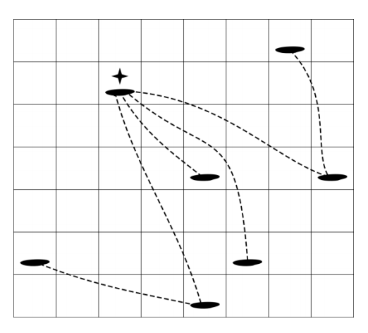

## 문제

“The land of a thousand islands” was an official motto of Croatian tourism in the mid nineteen-nineties. While the motto is technically inaccurate (there are slightly more than 1000 islands in Croatia), it is true that island hopping (sailing from island to island) is a popular summer activity.

For the purpose of this task, the map of the Adriatic sea is a grid consisting of unit squares organized into 2500 rows and 2500 columns. Rows are numbered 1 through 2500, north to south, while columns are numbered 1 through 2500, west to east. There are N islands in the sea, numbered 1 through N and each island is located inside some unit square of the grid. The location of island K is given by the coordinates of the corresponding grid square – its row number RK and its column number CK. Finally, no two islands have the same location.

Figure 1: Map corresponding to the first test example below

Due to winds and sea currents, it is possible to sail directly from an island only to those islands that are located in the general northwest or southeast directions. More precisely, it is possible to sail from island A to island B in one hop if either both RA < RB and CA < CB hold or both RA > RB and CA > CB hold. Note that the distance between the two islands or the presence of other islands between them does not affect the possibility of hopping from one to the other. If it is not possible to hop directly from A to B, it might be possible to sail from A to B via other islands using some sequence of hops. The sailing distance from A to B is defined as the smallest number of hops required to sail from A to B.

For example, in the figure above, starting from the island at row 2, column 3, we can hop to four other islands while the sailing distance to the remaining two islands is two.

A sailing congress is being planned and the organizers are considering each of the islands as a possible location for the congress. When considering a candidate island they would like to know: if every other island sends a single sailboat, what is the smallest total number of hops required in order for all sailboats to reach the candidate island, or equivalently, what is the sum of sailing distances from all other islands to the candidate island. Write a program that will, given the locations of N islands, for each island K, calculate the sum of sailing distances from all other islands to island K.

Test data will be such that, for all islands A and B it is possible to sail from A to B using some sequence of hops.

## 입력

The first line of input contains an integer N (3 ≤ N ≤ 250 000), the number of islands. The following N lines contain the locations of the islands. Each location is a pair of integers between 1 and 2500 (inclusive), the row and column numbers, respectively.

## 출력

The output should contain N lines. For each island, in the same order they were given in the input, output the sum of sailing distances from all other islands on a single line.
