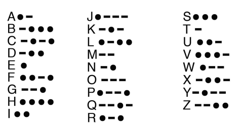

## 문제

Morse code was an early method of communication via electronic signals. Each letter and number was represented by a unique series of long and short tones, with a pause to indicate the beginning of the next character. Implement a Morse Code interpreter, using the key to the right, that translates five-letter messages (no more, no less).

## 입력

The first line of input is the number of test cases that follow.

Each input case appears on a single line, and will include five Morse code characters, a space-separated series of long and short tones, represented by dots and dashes.

There will be at most 1000 test cases.

## 출력

For each case, output the line “Case x:” where x is the case number, on a single line. Then output a single space followed by an all-caps alphanumeric representation of the message, exactly five characters in length.
