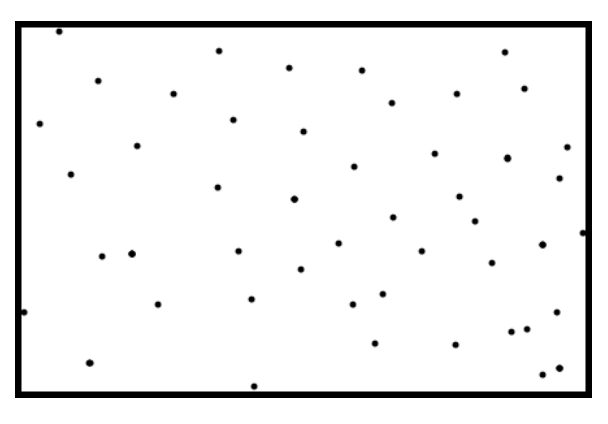

## 문제

Recently, your friend Oscar purchased an ant farm. He accidentally let the ants loose on his floor and now they’re crawling everywhere! You want to fence them off with a single continuous rectangle so that they’re not running amok. However, due to technical limitations your fence pieces must be aligned with the X and Y axes. The figure below shows an example of a fence around a set of ants (slight offsets from the border are just for visual effect).

What is the perimeter and area of the smallest fence that contains all of the ants?

## 입력

The first line of input is the number of test cases that follow. Each test case starts with an integer N (1 ≤ N ≤ 100) on a line by itself representing the number of ants. The following N lines of input contain two floating-point values X and Y (−1000.0 ≤ X, Y ≤ 1000.0) representing the position of an ant. You can assume that ants are single points–they have no area.

## 출력

For each case output the line “Case x:” where x is the case number, on a single line, followed by the string “Area” and the area of the fence as a floating-point value and then a comma, followed by a space and then “Perimeter” and the perimeter of the fence as a floating-point value. Floating-point value will be considered correct if it is within an absolute or relative error of 10-9 of the correct answer.
