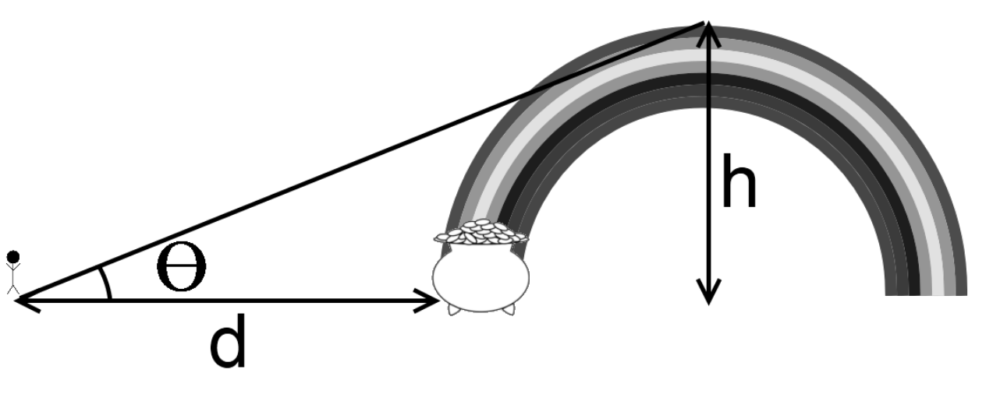

## 문제

After a long day of working on HSPC problems, you see a rainbow in the sky and want to figure out how far you have to walk to get your pot of gold. You are given a 2D plane and a semi-circle (rainbow) of height h placed with the center somewhere along the x-axis. You are also given an angle of inclination to view the top of the rainbow from the origin. Find how far away the closest point on the rainbow is to you by using the picture below to solve for d, the distance between you and the closest point on the rainbow. You can ignore the height/width of the person; treat them as a point.

## 입력

The first line of input is the number of test cases that follow. Each successive line represents a single test case, and will be composed of two floating point numbers, separated by a single space. The first value is h (1 ≤ h ≤ 105), the height of the rainbow at its highest point. The second is the angle of inclination θ (0 < θ < 90). These real numbers will consist of decimal digits and at most one decimal point.

## 출력

For each case output the line “Case x:” where x is the case number, on a single line, followed by d, the distance from you to the rainbow, with an absolute or relative error of at most 10−6.

If you and the rainbow are infinitely far way from each other, print "Infinity".
