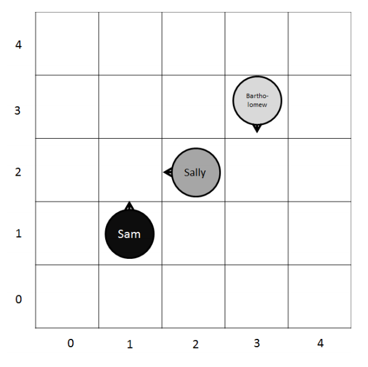

## 문제

The neighborhood kids have come up with another crazy game. Everybody runs back and forth within bounds, but they can only move in straight lines! The rules of the game are as follows:

* Before the game starts, someone is chosen to be “it.”
* The game goes for a set amount of rounds, during which each player may take one step in their given direction.
* If more than two players land on a spot at one time, they all reverse their direction.
* If only two collide, then they will switch directions for the next step as follows. The one with the longer name starts moving in the direction that the other would. The one with the shorter name takes the reverse of the direction of the other player. (This only works because all of the kids in the neighborhood have different length names.)
* If a player’s next step would put the player out of bounds, they reverse direction before taking their step.
* The winner is the person who ends up closest to the “it” player, with ties going to the person with the shorter name.

John thinks that this game is silly, since he could predict the outcome just by knowing the initial configuration. He wants you to write a program to do just that so he can show the other kids and convince them to play better games.

Below is the representation of the first test case. Note that (0,0) is the bottom-left corner.

## 입력

The first line of input is the number of test cases that follow. Each test case begins with a line containing integers M, N, and P: the field’s width, its height (both measured in “steps”), and the number of players, respectively (M, N, P < 10). The next P lines contain space-separated values, starting with the name of one kid, followed by the x and y coordinates of their starting position on the field and the direction in which they start (N, S, E, or W). No two kids will start in the same spot. The first of the kids listed is “it” for the game. The last line of the test case (≤ 1000) is the number of rounds to play.

## 출력

For each case output “Case x:” where x is the case number, on a single line, followed by a space, and the name of the winner for that test case.
