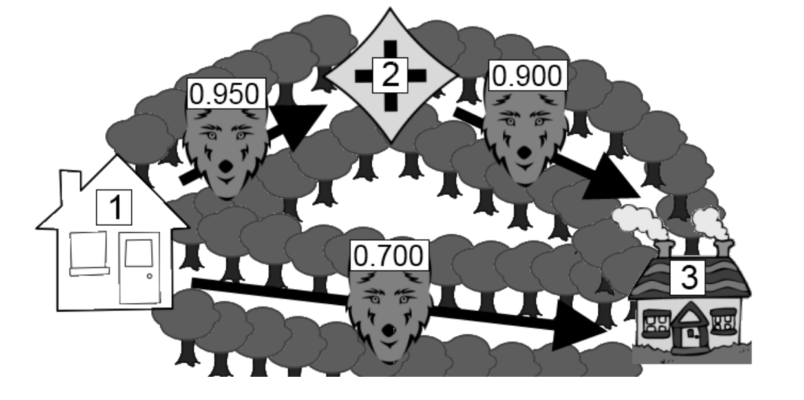

## 문제

Little Red Riding Hood is walking to visit her Grandmother’s house. Thankfully, Little Red Riding Hood is an avid reader of the Bid Bad Wolf’s blog, which details the paths he and his friends are guarding. The Big Bad Wolf is no technological slouch, and knows the importance of keeping information private; thus his blog only states the likelihood that a path won’t be guarded by a wolf. Should Little Red Riding Hood take a path that a wolf is guarding, she will be devoured, which is never a good thing. Paths through the forest are one-directional, and Little Red Riding Hood may not go backwards along a path. What route should Little Red Riding Hood take to maximize the chance of making it to Grandmother’s?

Below is a diagram representing the first test case.

## 입력

The first line of input is the number of test cases that follow. Each test case starts with an integer N (1 ≤ N ≤ 100) on a line by itself representing the number of intersections. Then there will be a single line with two integers, X and Y (1 ≤ X, Y ≤ N), separated by a single space, indicating the numbers of the start (X) and end (Y ) intersections. There will always be a path from the starting intersection to the ending intersection. Then the input will contain a single line with an integer M (0 ≤ M ≤ 5000), indicating the number of directed paths. M lines will follow, each containing three values separated by spaces: the start intersection A, the end intersection B, and the likelihood represented as a floating point number (0.000 < P ≤ 1.000) that a path is safe–there is no wolf on that path. There can be multiple paths between the same two intersections. The floating point number is consist of decimal digits and at most three decimal points.

## 출력

For each case output “Case x:” where x is the case number, on a single line, followed by the chance that Little Red Riding Hood makes it to Grandmother’s house if she takes the safest path, with an absolute or relative error of at most 10−3.
